# Android IoT Hardware Integration Design

## Overview

This design document outlines the development of a native Android application for IoT hardware integration that provides direct hardware access, enhanced performance, and superior user experience compared to web-based solutions. The application will leverage Android's native capabilities for Bluetooth LE, WiFi, USB serial communication, and MQTT protocols to enable real-time control and monitoring of IoT devices.

## Technology Stack & Dependencies

### Core Android Technologies
- **Framework**: Android SDK (API Level 21+ / Android 5.0+)
- **Language**: Kotlin with coroutines for async operations
- **Architecture**: MVVM with Android Architecture Components
- **Dependency Injection**: Hilt (Dagger-based)
- **Database**: Room with SQLite backend
- **Networking**: Retrofit2 + OkHttp3 for HTTP, Paho MQTT for real-time messaging

### Hardware Integration Libraries
- **Bluetooth LE**: Android BluetoothAdapter + AndroidX Bluetooth
- **WiFi Management**: WifiManager + Network Connection API
- **USB Serial**: USB Host API + third-party USB serial libraries
- **Camera/QR**: CameraX + ML Kit Barcode Scanning
- **Location**: FusedLocationProviderClient

### UI/UX Framework
- **UI Toolkit**: Jetpack Compose (modern declarative UI)
- **Material Design**: Material Design 3 components
- **Navigation**: Navigation Compose
- **Theming**: Dynamic color theming with Material You

### Background Processing
- **Services**: Foreground Services for persistent connections
- **Work Manager**: Scheduled tasks and background sync
- **Notifications**: Firebase Cloud Messaging (FCM)

## Component Architecture

### Application Architecture Overview

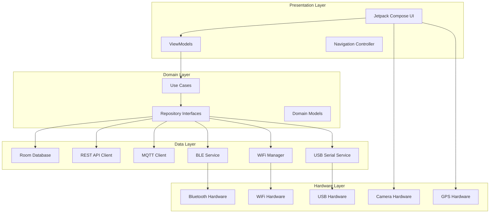
```mermaid
graph TB
    subgraph "Presentation Layer"
        UI[Jetpack Compose UI]
        VM[ViewModels]
        NAV[Navigation Controller]
    end
    
    subgraph "Domain Layer"
        UC[Use Cases]
        REPO[Repository Interfaces]
        MODELS[Domain Models]
    end
    
    subgraph "Data Layer"
        ROOM[Room Database]
        API[REST API Client]
        MQTT[MQTT Client]
        BLE[BLE Service]
        WIFI[WiFi Manager]
        USB[USB Serial Service]
    end
    
    subgraph "Hardware Layer"
        BLUETOOTH[Bluetooth Hardware]
        WIFIDEV[WiFi Hardware]
        USBDEV[USB Hardware]
        CAM[Camera Hardware]
        GPS[GPS Hardware]
    end
    
    UI --> VM
    VM --> UC
    UC --> REPO
    REPO --> ROOM
    REPO --> API
    REPO --> MQTT
    REPO --> BLE
    REPO --> WIFI
    REPO --> USB
    
    BLE --> BLUETOOTH
    WIFI --> WIFIDEV
    USB --> USBDEV
    UI --> CAM
    UI --> GPS
```

### Core Components Structure

#### 1. Hardware Abstraction Layer
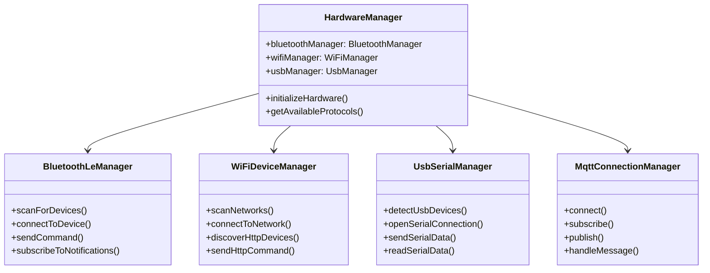
```mermaid
classDiagram
    class HardwareManager {
        +bluetoothManager: BluetoothManager
        +wifiManager: WiFiManager
        +usbManager: UsbManager
        +initializeHardware()
        +getAvailableProtocols()
    }
    
    class BluetoothLeManager {
        +scanForDevices()
        +connectToDevice()
        +sendCommand()
        +subscribeToNotifications()
    }
    
    class WiFiDeviceManager {
        +scanNetworks()
        +connectToNetwork()
        +discoverHttpDevices()
        +sendHttpCommand()
    }
    
    class UsbSerialManager {
        +detectUsbDevices()
        +openSerialConnection()
        +sendSerialData()
        +readSerialData()
    }
    
    class MqttConnectionManager {
        +connect()
        +subscribe()
        +publish()
        +handleMessage()
    }
    
    HardwareManager --> BluetoothLeManager
    HardwareManager --> WiFiDeviceManager
    HardwareManager --> UsbSerialManager
    HardwareManager --> MqttConnectionManager
```

#### 2. Data Management Architecture
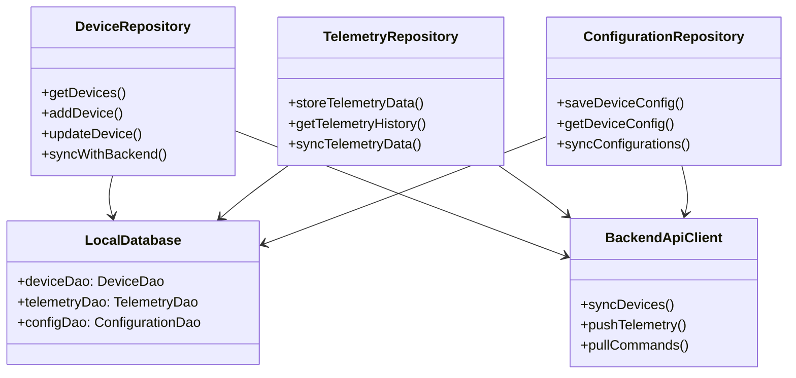
```mermaid
classDiagram
    class DeviceRepository {
        +getDevices()
        +addDevice()
        +updateDevice()
        +syncWithBackend()
    }
    
    class TelemetryRepository {
        +storeTelemetryData()
        +getTelemetryHistory()
        +syncTelemetryData()
    }
    
    class ConfigurationRepository {
        +saveDeviceConfig()
        +getDeviceConfig()
        +syncConfigurations()
    }
    
    class LocalDatabase {
        +deviceDao: DeviceDao
        +telemetryDao: TelemetryDao
        +configDao: ConfigurationDao
    }
    
    class BackendApiClient {
        +syncDevices()
        +pushTelemetry()
        +pullCommands()
    }
    
    DeviceRepository --> LocalDatabase
    DeviceRepository --> BackendApiClient
    TelemetryRepository --> LocalDatabase
    TelemetryRepository --> BackendApiClient
    ConfigurationRepository --> LocalDatabase
    ConfigurationRepository --> BackendApiClient
```

## Hardware Integration Implementation

### Bluetooth LE Integration

#### BLE Device Discovery and Connection
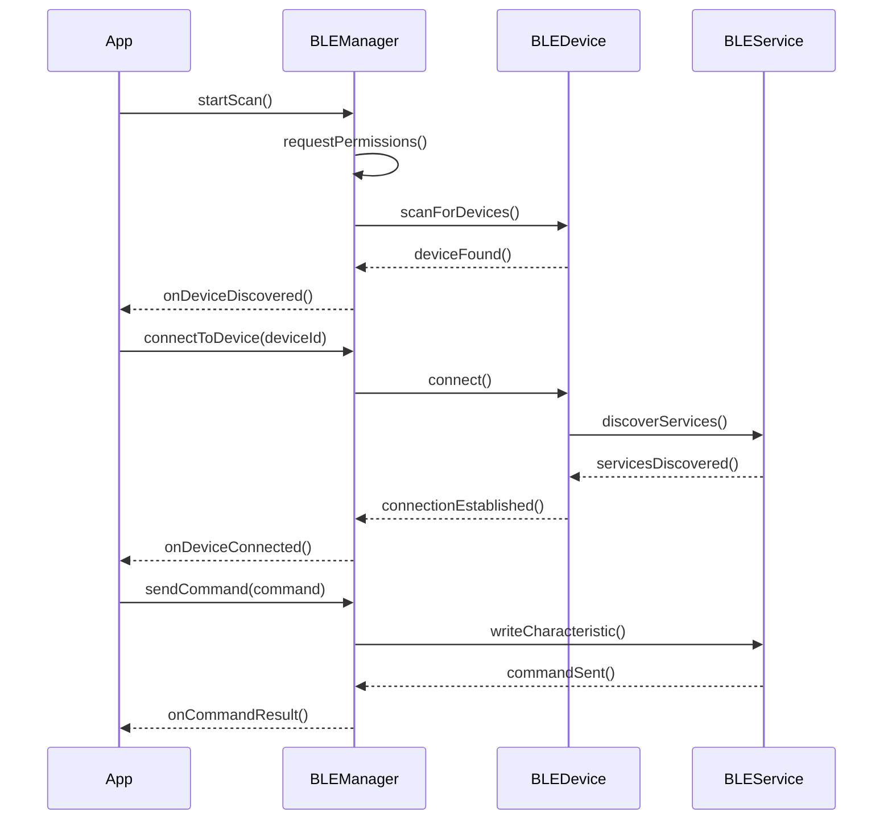
```mermaid
sequenceDiagram
    participant App
    participant BLEManager
    participant BLEDevice
    participant BLEService
    
    App->>BLEManager: startScan()
    BLEManager->>BLEManager: requestPermissions()
    BLEManager->>BLEDevice: scanForDevices()
    BLEDevice-->>BLEManager: deviceFound()
    BLEManager-->>App: onDeviceDiscovered()
    
    App->>BLEManager: connectToDevice(deviceId)
    BLEManager->>BLEDevice: connect()
    BLEDevice->>BLEService: discoverServices()
    BLEService-->>BLEDevice: servicesDiscovered()
    BLEDevice-->>BLEManager: connectionEstablished()
    BLEManager-->>App: onDeviceConnected()
    
    App->>BLEManager: sendCommand(command)
    BLEManager->>BLEService: writeCharacteristic()
    BLEService-->>BLEManager: commandSent()
    BLEManager-->>App: onCommandResult()
```

#### BLE Implementation Details
- **Scanning Strategy**: Use low-power scanning with configurable intervals
- **Connection Management**: Implement connection pooling for multiple devices
- **Service Discovery**: Cache discovered services and characteristics
- **Data Transfer**: Support for both notification and indication patterns
- **Error Handling**: Automatic reconnection with exponential backoff

### WiFi Device Management

#### WiFi Network Scanning and Device Discovery
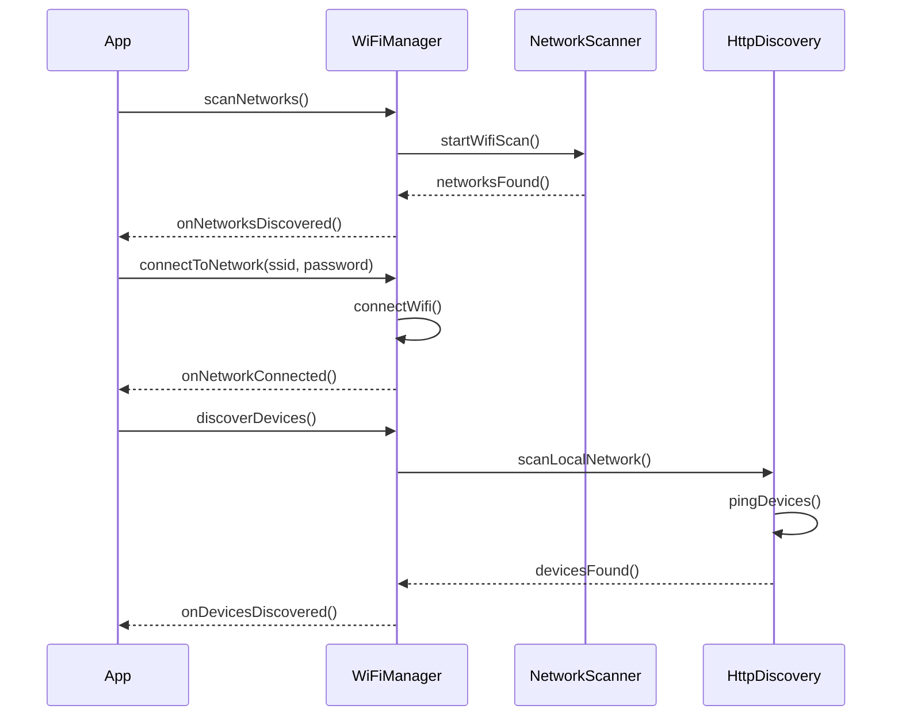
```mermaid
sequenceDiagram
    participant App
    participant WiFiManager
    participant NetworkScanner
    participant HttpDiscovery
    
    App->>WiFiManager: scanNetworks()
    WiFiManager->>NetworkScanner: startWifiScan()
    NetworkScanner-->>WiFiManager: networksFound()
    WiFiManager-->>App: onNetworksDiscovered()
    
    App->>WiFiManager: connectToNetwork(ssid, password)
    WiFiManager->>WiFiManager: connectWifi()
    WiFiManager-->>App: onNetworkConnected()
    
    App->>WiFiManager: discoverDevices()
    WiFiManager->>HttpDiscovery: scanLocalNetwork()
    HttpDiscovery->>HttpDiscovery: pingDevices()
    HttpDiscovery-->>WiFiManager: devicesFound()
    WiFiManager-->>App: onDevicesDiscovered()
```

#### WiFi Implementation Features
- **Network Management**: Programmatic WiFi connection with WPA3 support
- **Device Discovery**: mDNS/Bonjour and UPnP device discovery
- **HTTP Communication**: RESTful API calls with automatic retry logic
- **Network Monitoring**: Real-time connection quality monitoring

### USB Serial Communication

#### LoRa Module Integration via USB
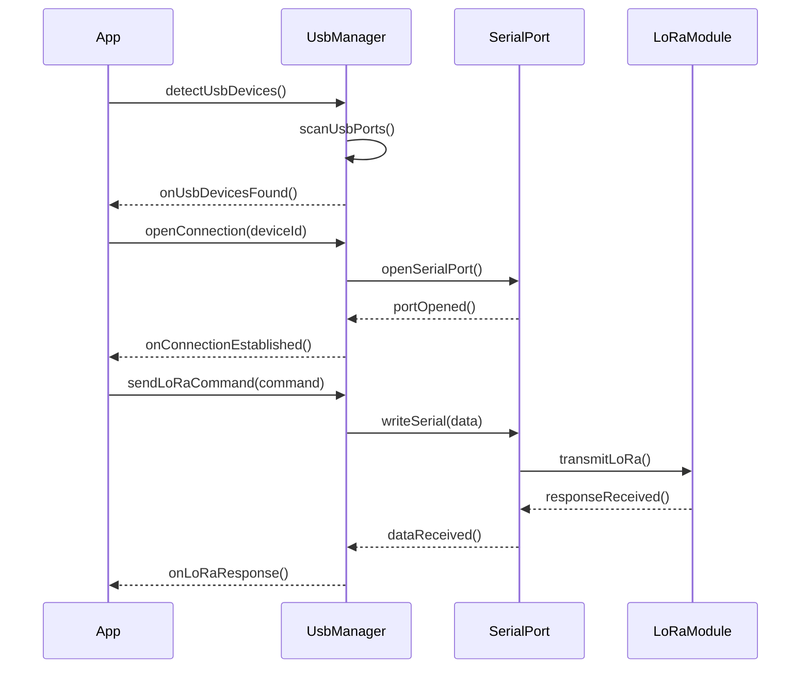
```mermaid
sequenceDiagram
    participant App
    participant UsbManager
    participant SerialPort
    participant LoRaModule
    
    App->>UsbManager: detectUsbDevices()
    UsbManager->>UsbManager: scanUsbPorts()
    UsbManager-->>App: onUsbDevicesFound()
    
    App->>UsbManager: openConnection(deviceId)
    UsbManager->>SerialPort: openSerialPort()
    SerialPort-->>UsbManager: portOpened()
    UsbManager-->>App: onConnectionEstablished()
    
    App->>UsbManager: sendLoRaCommand(command)
    UsbManager->>SerialPort: writeSerial(data)
    SerialPort->>LoRaModule: transmitLoRa()
    LoRaModule-->>SerialPort: responseReceived()
    SerialPort-->>UsbManager: dataReceived()
    UsbManager-->>App: onLoRaResponse()
```

#### USB Serial Features
- **Hardware Detection**: Automatic USB device enumeration
- **Serial Protocol Support**: FTDI, CP210x, CH340 chip support
- **LoRa Integration**: AT command interface for LoRa modules
- **Data Buffering**: Efficient data streaming with flow control

### MQTT Real-time Communication

#### MQTT Service Architecture
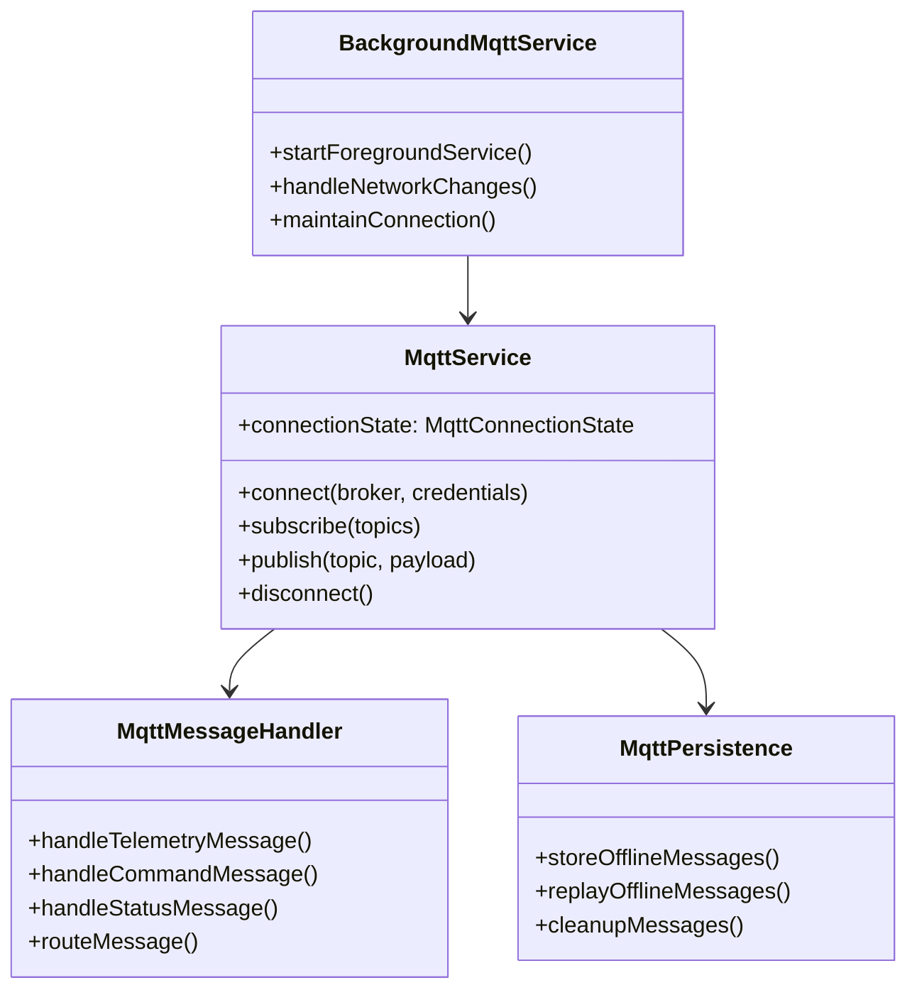
```mermaid
classDiagram
    class MqttService {
        +connectionState: MqttConnectionState
        +connect(broker, credentials)
        +subscribe(topics)
        +publish(topic, payload)
        +disconnect()
    }
    
    class MqttMessageHandler {
        +handleTelemetryMessage()
        +handleCommandMessage()
        +handleStatusMessage()
        +routeMessage()
    }
    
    class MqttPersistence {
        +storeOfflineMessages()
        +replayOfflineMessages()
        +cleanupMessages()
    }
    
    class BackgroundMqttService {
        +startForegroundService()
        +handleNetworkChanges()
        +maintainConnection()
    }
    
    MqttService --> MqttMessageHandler
    MqttService --> MqttPersistence
    BackgroundMqttService --> MqttService
```

## Real-time Features Implementation

### Background Services Architecture

#### Persistent Connection Management
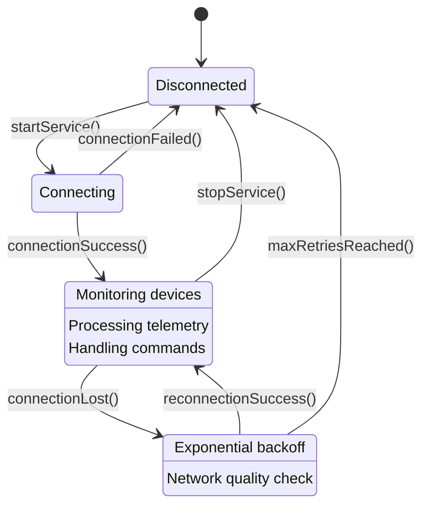
```mermaid
stateDiagram-v2
    [*] --> Disconnected
    Disconnected --> Connecting: startService()
    Connecting --> Connected: connectionSuccess()
    Connecting --> Disconnected: connectionFailed()
    Connected --> Reconnecting: connectionLost()
    Connected --> Disconnected: stopService()
    Reconnecting --> Connected: reconnectionSuccess()
    Reconnecting --> Disconnected: maxRetriesReached()
    
    Connected : Monitoring devices
    Connected : Processing telemetry
    Connected : Handling commands
    
    Reconnecting : Exponential backoff
    Reconnecting : Network quality check
```

### Push Notifications Integration

#### Notification Architecture
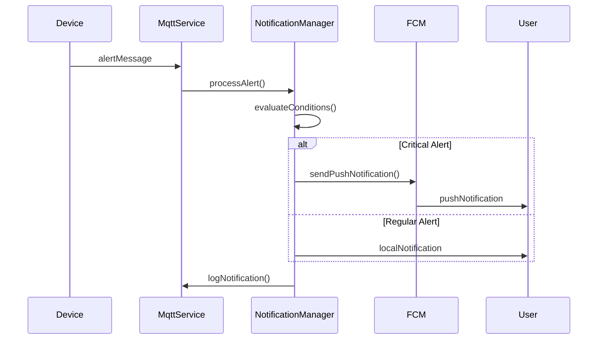
```mermaid
sequenceDiagram
    participant Device
    participant MqttService
    participant NotificationManager
    participant FCM
    participant User
    
    Device->>MqttService: alertMessage
    MqttService->>NotificationManager: processAlert()
    NotificationManager->>NotificationManager: evaluateConditions()
    
    alt Critical Alert
        NotificationManager->>FCM: sendPushNotification()
        FCM->>User: pushNotification
    else Regular Alert
        NotificationManager->>User: localNotification
    end
    
    NotificationManager->>MqttService: logNotification()
```

## Enhanced Mobile Capabilities

### Camera Integration for Device Setup

#### QR Code Device Provisioning
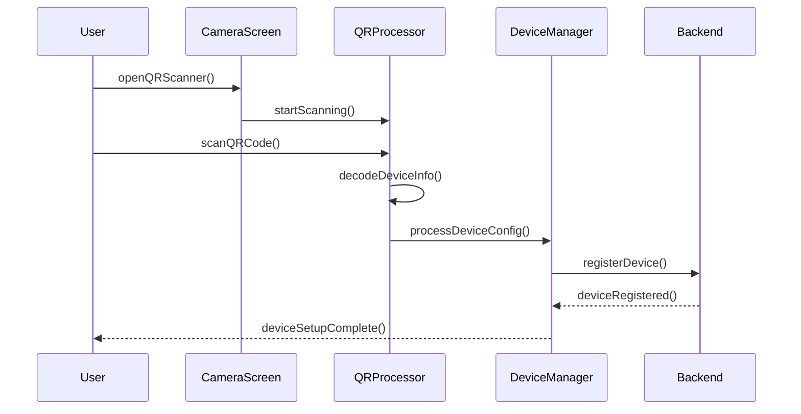
```mermaid
sequenceDiagram
    participant User
    participant CameraScreen
    participant QRProcessor
    participant DeviceManager
    participant Backend
    
    User->>CameraScreen: openQRScanner()
    CameraScreen->>QRProcessor: startScanning()
    User->>QRProcessor: scanQRCode()
    QRProcessor->>QRProcessor: decodeDeviceInfo()
    QRProcessor->>DeviceManager: processDeviceConfig()
    DeviceManager->>Backend: registerDevice()
    Backend-->>DeviceManager: deviceRegistered()
    DeviceManager-->>User: deviceSetupComplete()
```

### Location-based Features

#### GPS Device Mapping
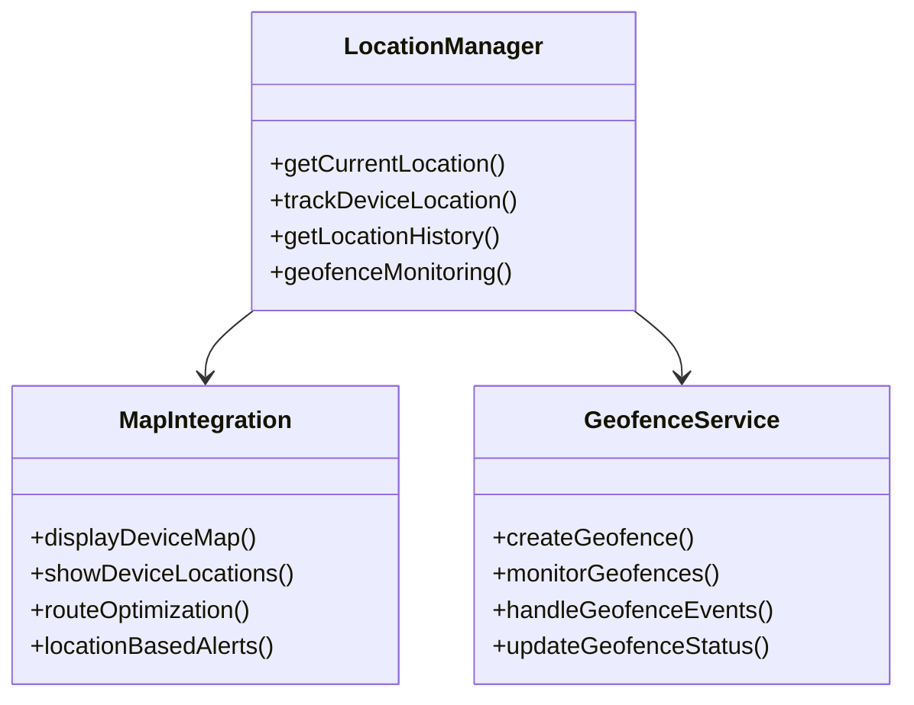
```mermaid
classDiagram
    class LocationManager {
        +getCurrentLocation()
        +trackDeviceLocation()
        +getLocationHistory()
        +geofenceMonitoring()
    }
    
    class MapIntegration {
        +displayDeviceMap()
        +showDeviceLocations()
        +routeOptimization()
        +locationBasedAlerts()
    }
    
    class GeofenceService {
        +createGeofence()
        +monitorGeofences()
        +handleGeofenceEvents()
        +updateGeofenceStatus()
    }
    
    LocationManager --> MapIntegration
    LocationManager --> GeofenceService
```

### Offline Operation Architecture

#### Local Data Management
```mermaid
graph TB
    subgraph "Online Mode"
        SYNC[Real-time Sync]
        CLOUD[Cloud Backend]
        REALTIME[Real-time Updates]
    end
    
    subgraph "Offline Mode"
        LOCAL[Local Database]
        QUEUE[Command Queue]
        CACHE[Data Cache]
    end
    
    subgraph "Sync Engine"
        CONFLICT[Conflict Resolution]
        MERGE[Data Merge]
        RETRY[Retry Logic]
    end
    
    ONLINE --> OFFLINE: Network Lost
    OFFLINE --> SYNC: Network Restored
    
    LOCAL --> QUEUE
    QUEUE --> CACHE
    CACHE --> CONFLICT
    CONFLICT --> MERGE
    MERGE --> RETRY
```

## State Management Strategy

### MVVM with Repository Pattern

#### State Flow Architecture
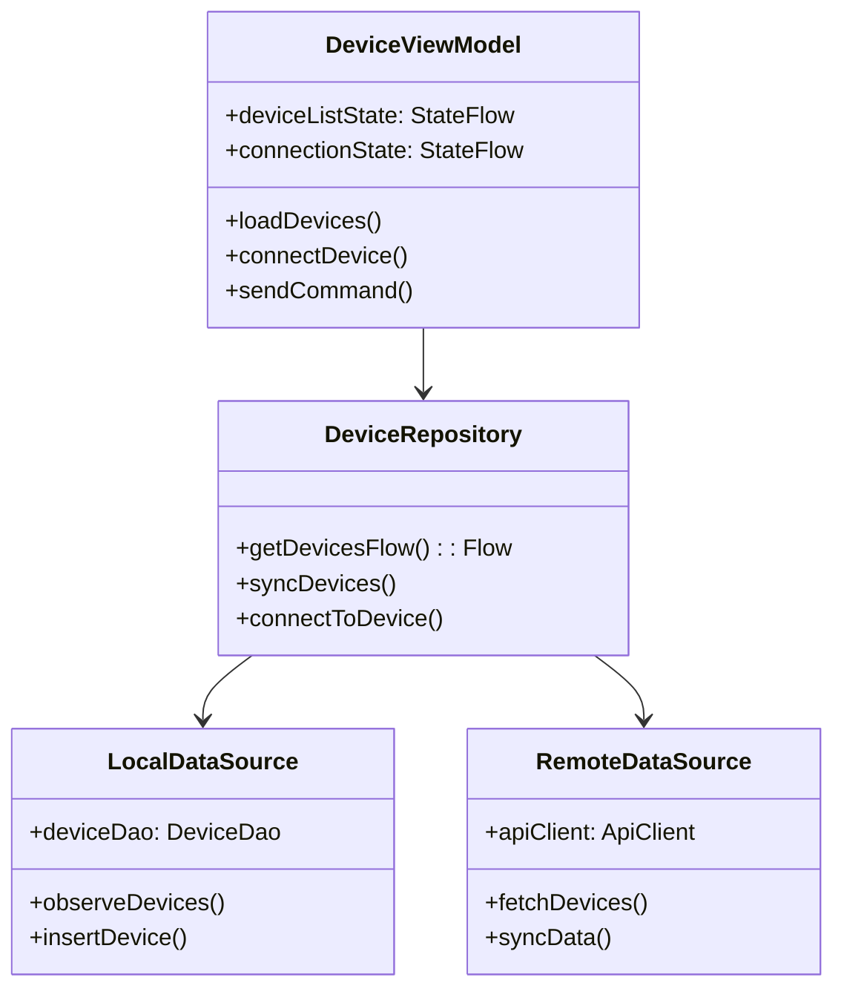
```mermaid
classDiagram
    class DeviceViewModel {
        +deviceListState: StateFlow
        +connectionState: StateFlow
        +loadDevices()
        +connectDevice()
        +sendCommand()
    }
    
    class DeviceRepository {
        +getDevicesFlow(): Flow
        +syncDevices()
        +connectToDevice()
    }
    
    class LocalDataSource {
        +deviceDao: DeviceDao
        +observeDevices()
        +insertDevice()
    }
    
    class RemoteDataSource {
        +apiClient: ApiClient
        +fetchDevices()
        +syncData()
    }
    
    DeviceViewModel --> DeviceRepository
    DeviceRepository --> LocalDataSource
    DeviceRepository --> RemoteDataSource
```

### Reactive Data Flow

#### State Management with Coroutines
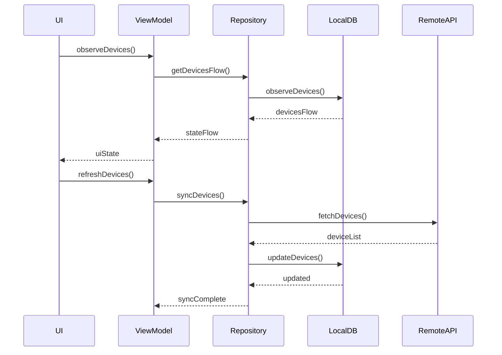
```mermaid
sequenceDiagram
    participant UI
    participant ViewModel
    participant Repository
    participant LocalDB
    participant RemoteAPI
    
    UI->>ViewModel: observeDevices()
    ViewModel->>Repository: getDevicesFlow()
    Repository->>LocalDB: observeDevices()
    LocalDB-->>Repository: devicesFlow
    Repository-->>ViewModel: stateFlow
    ViewModel-->>UI: uiState
    
    UI->>ViewModel: refreshDevices()
    ViewModel->>Repository: syncDevices()
    Repository->>RemoteAPI: fetchDevices()
    RemoteAPI-->>Repository: deviceList
    Repository->>LocalDB: updateDevices()
    LocalDB-->>Repository: updated
    Repository-->>ViewModel: syncComplete
```

## Backend Integration Layer

### API Client Architecture

#### REST API Integration
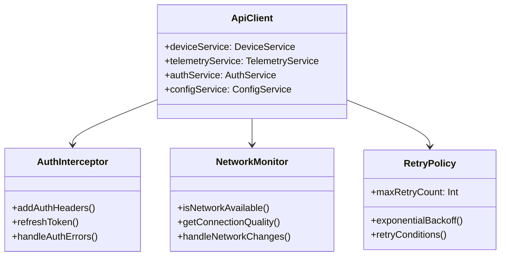
```mermaid
classDiagram
    class ApiClient {
        +deviceService: DeviceService
        +telemetryService: TelemetryService
        +authService: AuthService
        +configService: ConfigService
    }
    
    class AuthInterceptor {
        +addAuthHeaders()
        +refreshToken()
        +handleAuthErrors()
    }
    
    class NetworkMonitor {
        +isNetworkAvailable()
        +getConnectionQuality()
        +handleNetworkChanges()
    }
    
    class RetryPolicy {
        +exponentialBackoff()
        +maxRetryCount: Int
        +retryConditions()
    }
    
    ApiClient --> AuthInterceptor
    ApiClient --> NetworkMonitor
    ApiClient --> RetryPolicy
```

### Data Synchronization Strategy

#### Sync Architecture
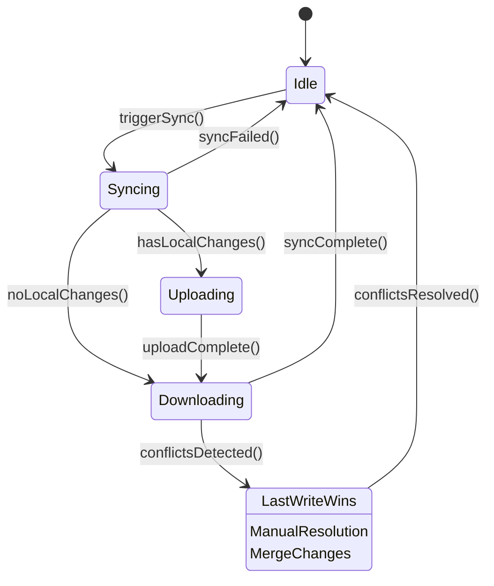
```mermaid
stateDiagram-v2
    [*] --> Idle
    Idle --> Syncing: triggerSync()
    Syncing --> Uploading: hasLocalChanges()
    Syncing --> Downloading: noLocalChanges()
    Uploading --> Downloading: uploadComplete()
    Downloading --> ConflictResolution: conflictsDetected()
    Downloading --> Idle: syncComplete()
    ConflictResolution --> Idle: conflictsResolved()
    Syncing --> Idle: syncFailed()
    
    ConflictResolution : LastWriteWins
    ConflictResolution : ManualResolution
    ConflictResolution : MergeChanges
```

## Testing Strategy

### Unit Testing Architecture

#### Test Structure
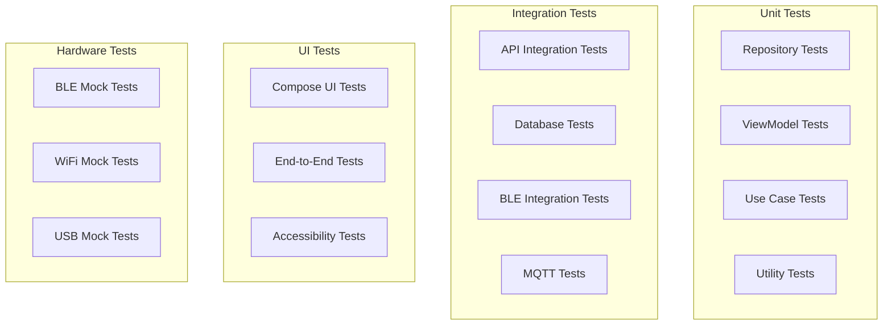
```mermaid
graph TB
    subgraph "Unit Tests"
        REPO_TEST[Repository Tests]
        VM_TEST[ViewModel Tests]
        USE_CASE_TEST[Use Case Tests]
        UTIL_TEST[Utility Tests]
    end
    
    subgraph "Integration Tests"
        API_TEST[API Integration Tests]
        DB_TEST[Database Tests]
        BLE_TEST[BLE Integration Tests]
        MQTT_TEST[MQTT Tests]
    end
    
    subgraph "UI Tests"
        COMPOSE_TEST[Compose UI Tests]
        E2E_TEST[End-to-End Tests]
        ACCESSIBILITY_TEST[Accessibility Tests]
    end
    
    subgraph "Hardware Tests"
        BLE_MOCK[BLE Mock Tests]
        WIFI_MOCK[WiFi Mock Tests]
        USB_MOCK[USB Mock Tests]
    end
```

### Testing Implementation

#### Hardware Mocking Strategy
- **BLE Testing**: Mock BluetoothAdapter with predefined device responses
- **WiFi Testing**: Mock WifiManager with controlled network states
- **USB Testing**: Virtual serial port simulation
- **MQTT Testing**: Embedded MQTT broker for testing
- **API Testing**: MockWebServer for backend API simulation

### Performance Testing

#### Performance Metrics
- **Battery Usage**: Background service optimization testing
- **Memory Usage**: Heap dump analysis and leak detection
- **Network Efficiency**: Data usage optimization testing
- **Connection Latency**: Real-time communication performance
- **UI Responsiveness**: Frame rate analysis during heavy operations

## Implementation Timeline

### Phase 1: Foundation (Weeks 1-2)
- **Architecture Setup**: MVVM + Hilt dependency injection
- **Database Layer**: Room database with basic entities
- **UI Framework**: Jetpack Compose base screens
- **Bluetooth LE**: Basic scanning and connection
- **Permissions**: Runtime permission handling

### Phase 2: Core Connectivity (Weeks 3-4)
- **WiFi Integration**: Network scanning and HTTP communication
- **BLE Services**: Full GATT service implementation
- **Local Storage**: Device configuration persistence
- **Background Services**: Foreground service for connections
- **Basic UI**: Device list and connection status

### Phase 3: Real-time Features (Weeks 5-6)
- **MQTT Service**: Persistent MQTT connections
- **Push Notifications**: FCM integration and local notifications
- **Telemetry Processing**: Real-time data visualization
- **State Management**: Complete reactive data flow
- **Offline Support**: Basic offline operation

### Phase 4: Advanced Hardware (Weeks 7-8)
- **USB Serial**: LoRa module communication
- **Protocol Abstraction**: Multi-protocol device support
- **Command Processing**: Bidirectional communication
- **Error Handling**: Robust error recovery
- **Performance Optimization**: Connection management optimization

### Phase 5: Enhanced Features (Weeks 9-10)
- **Camera Integration**: QR code device setup
- **Location Services**: GPS tracking and geofencing
- **Advanced UI**: Dashboard customization
- **Data Analytics**: Local telemetry analysis
- **Security Enhancements**: Certificate pinning and encryption

### Phase 6: Integration & Polish (Weeks 11-12)
- **Backend Sync**: Full cloud synchronization
- **Conflict Resolution**: Data merge strategies
- **Testing**: Comprehensive test coverage
- **Performance Tuning**: Battery and memory optimization
- **Documentation**: User guides and API documentation