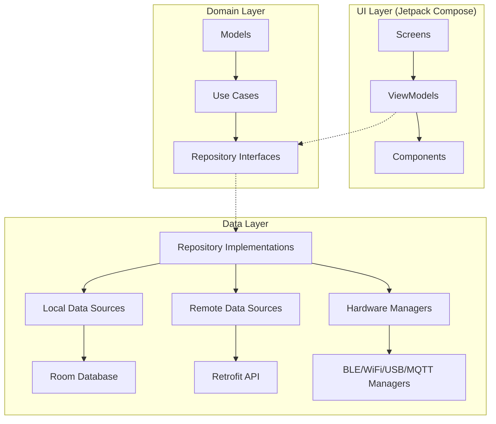
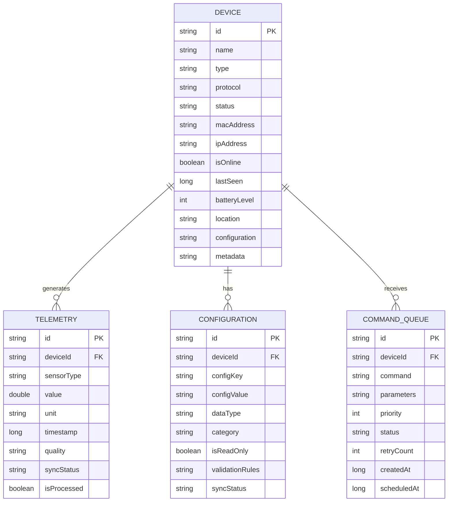
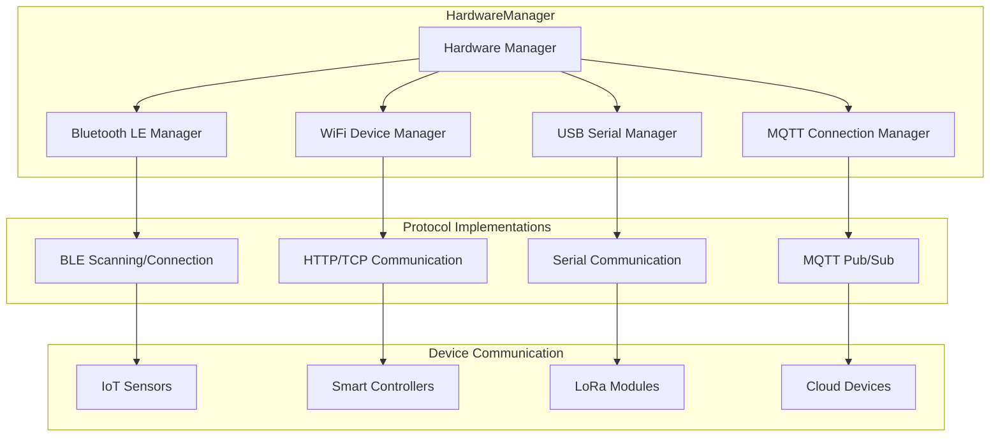
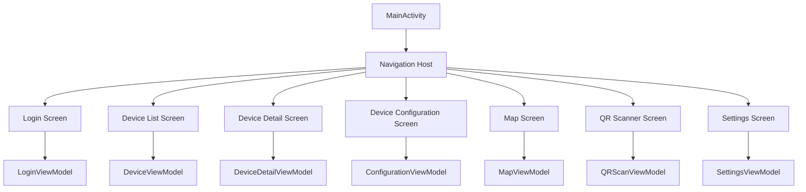
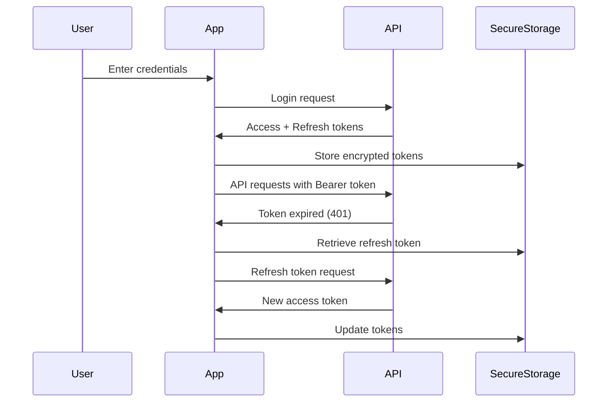
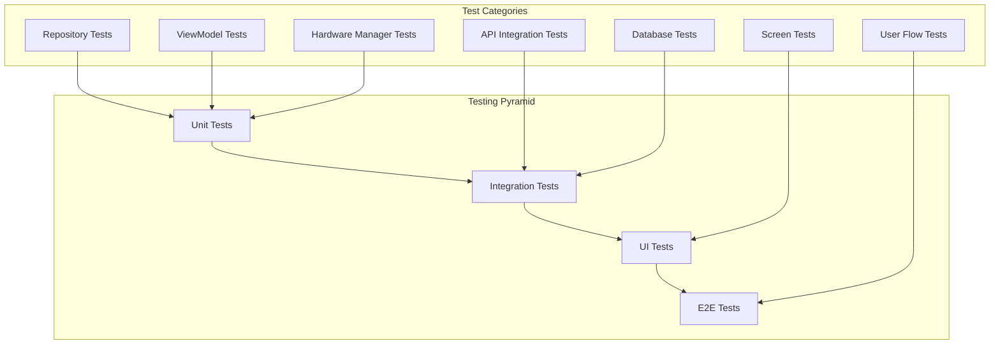
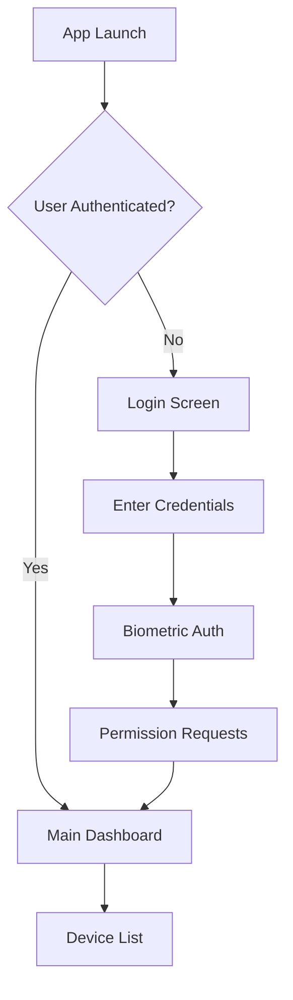
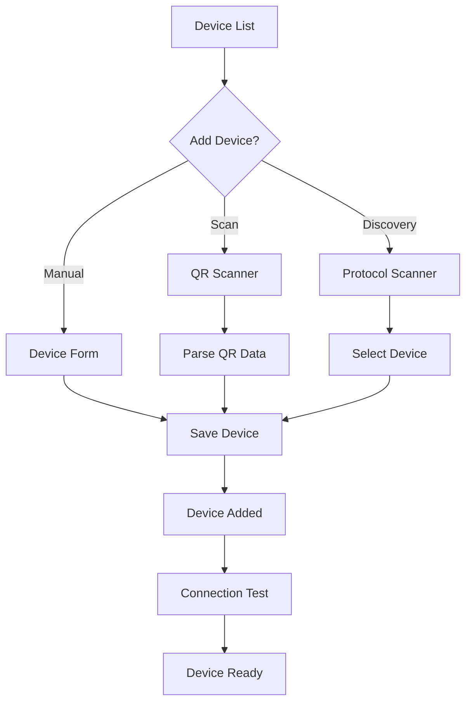
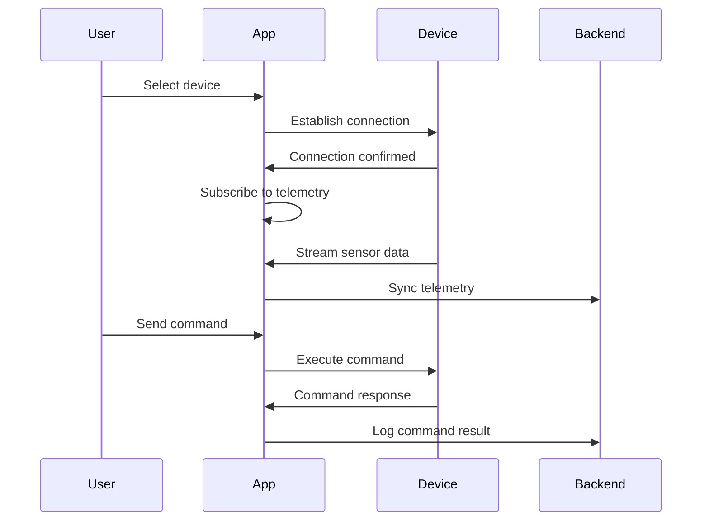

# IoT Logic Android Application - Complete Codebase Analysis

## Overview

IoT Logic is a comprehensive Android application for managing IoT devices using multiple communication protocols including Bluetooth LE, WiFi, USB Serial, and MQTT. The application follows Clean Architecture principles with MVVM pattern, built using modern Android development technologies.

### Key Features

- **Multi-Protocol Device Support**: BLE, WiFi, USB Serial, and MQTT connectivity
- **Real-time Telemetry Monitoring**: Live sensor data visualization and analytics  
- **Offline Functionality**: Command queuing and data synchronization when connectivity is restored
- **Device Discovery**: Automatic scanning and QR code-based device provisioning
- **Push Notifications**: FCM-based alerts for device status and threshold violations
- **Geofencing**: Location-based device automation and tracking
- **Secure Authentication**: Biometric login and secure token management
- **Modern UI**: Material Design 3 with Jetpack Compose

## Architecture

### Clean Architecture Implementation

The application follows a three-layer Clean Architecture pattern:



### Technology Stack

| Component | Technology | Purpose |
|-----------|------------|---------|
| **UI Framework** | Jetpack Compose | Modern, declarative UI |
| **Architecture** | MVVM + Clean Architecture | Separation of concerns |
| **Dependency Injection** | Hilt/Dagger | Modular and testable code |
| **Local Database** | Room | Offline data persistence |
| **Network Client** | Retrofit + OkHttp | REST API communication |
| **Async Programming** | Coroutines + Flow | Reactive data streams |
| **Background Tasks** | WorkManager | Scheduled operations |
| **State Management** | StateFlow/LiveData | Reactive UI updates |

## Component Architecture

### 1. Domain Models

#### Device Model
```kotlin
data class Device(
    val id: String,
    val name: String,
    val type: String, // sensor, actuator, hybrid
    val protocol: String, // BLE, WiFi, USB, MQTT
    val status: String, // CONNECTED, DISCONNECTED, ERROR
    val macAddress: String?,
    val ipAddress: String?,
    val location: String?,
    val batteryLevel: Int?,
    val isOnline: Boolean,
    val configuration: Map<String, String>,
    val metadata: Map<String, String>
)
```

#### Telemetry Model
```kotlin
data class Telemetry(
    val id: String,
    val deviceId: String,
    val sensorType: String, // temperature, humidity, motion, etc.
    val value: Double,
    val unit: String?,
    val timestamp: Long,
    val quality: String?, // GOOD, QUESTIONABLE, BAD
    val syncStatus: SyncStatus
)
```

#### Configuration Model
```kotlin
data class Configuration(
    val id: String,
    val deviceId: String,
    val configKey: String,
    val configValue: String,
    val dataType: ConfigDataType, // STRING, INTEGER, DOUBLE, BOOLEAN, JSON
    val category: String, // NETWORK, SENSOR, COMMUNICATION, POWER
    val isReadOnly: Boolean,
    val validationRules: Map<String, Any>?
)
```

### 2. Data Layer Architecture

#### Database Schema (Room)


#### Repository Pattern Implementation

**DeviceRepository Interface:**
```kotlin
interface DeviceRepository {
    suspend fun getDevices(): Flow<List<Device>>
    suspend fun getDeviceById(deviceId: String): Result<Device>
    suspend fun saveDevice(device: Device): Result<Unit>
    suspend fun updateDeviceStatus(deviceId: String, isOnline: Boolean, lastSeen: Long): Result<Unit>
    suspend fun deleteDevice(deviceId: String): Result<Unit>
    suspend fun syncDevices(token: String): Result<Unit>
}
```

**Implementation with offline-first approach:**
- Local Room database as single source of truth
- Automatic background synchronization with remote API
- Conflict resolution for concurrent modifications

### 3. Hardware Integration Layer

#### Multi-Protocol Hardware Manager



#### Bluetooth LE Manager Features
- Device scanning with service UUID filtering
- GATT connection management with automatic reconnection
- Characteristic read/write/notify operations
- Connection state monitoring

#### WiFi Device Manager Features
- HTTP/HTTPS communication with custom endpoints
- TCP socket connections for real-time data
- Network discovery and device enumeration
- Authentication and certificate management

#### USB Serial Manager Features
- Support for multiple baud rates (9600-115200)
- LoRa module AT command interface
- Hardware flow control
- Bulk data transfer capabilities

#### MQTT Connection Manager Features
- Multiple broker support with failover
- QoS levels 0, 1, 2 support
- Topic subscription management
- TLS/SSL encryption
- Last Will and Testament (LWT) handling

### 4. UI Architecture (Jetpack Compose)

#### Screen Hierarchy


#### Key UI Components

**DeviceListScreen:**
- Status dashboard with device counts
- Real-time device list with connection status
- Pull-to-refresh functionality
- Search and filter capabilities
- Device connection controls

**DeviceDetailScreen:**
- Real-time telemetry charts
- Device information panel
- Control interface for actuators
- Configuration quick access
- Connection diagnostics

**DeviceConfigurationScreen:**
- Categorized configuration sections
- Type-specific input validation
- Bulk configuration operations
- Sync status indicators

### 5. Networking & API Integration

#### API Service Architecture
```kotlin
interface ApiService {
    // Authentication
    @POST("api/login.php")
    suspend fun login(@Body request: LoginRequest): Response<LoginResponse>
    
    // Device Management
    @GET("api/devices.php")
    suspend fun getDevices(@Header("Authorization") token: String): Response<DevicesResponse>
    
    // Telemetry
    @GET("api/telemetry.php")
    suspend fun getTelemetry(
        @Header("Authorization") token: String,
        @Query("device_id") deviceId: String?
    ): Response<TelemetryResponse>
    
    // Commands
    @POST("api/command.php")
    suspend fun sendCommand(
        @Header("Authorization") token: String,
        @Body request: SendCommandRequest
    ): Response<CommandResponse>
}
```

#### Network Configuration
- Base URL: `http://192.168.1.100/blynk/` (configurable)
- Connection timeout: 30 seconds
- Read/Write timeout: 30 seconds
- Automatic token refresh
- Request/Response logging in debug mode
- Certificate pinning for production

### 6. Background Services

#### MQTT Background Service
- Maintains persistent MQTT connections
- Handles real-time message processing
- Automatic reconnection with exponential backoff
- Message queuing for offline scenarios
- Foreground service for reliability

#### Device Connection Service  
- Manages active device connections
- Monitors connection health
- Handles automatic reconnection
- Command queue processing
- Battery optimization compliance

#### Sync Manager (WorkManager)
- Periodic data synchronization
- Retry logic for failed operations
- Network-aware scheduling
- Battery optimization compliance

### 7. Security & Authentication

#### Authentication Flow


#### Security Features
- Encrypted token storage using EncryptedSharedPreferences
- Biometric authentication (fingerprint, face)
- Certificate pinning for API calls
- Local database encryption
- Secure communication over HTTPS/TLS

### 8. Notification System

#### Notification Channels
- **Device Alerts**: Critical device issues (HIGH priority)
- **System Updates**: App notifications (DEFAULT priority)
- **Connection Status**: Connectivity changes (LOW priority)
- **Geofence Events**: Location-based alerts (HIGH priority)

#### FCM Integration
- Push notification handling
- Topic subscription management
- Custom notification payloads
- Deep linking to specific screens

### 9. Testing Strategy

#### Test Coverage Architecture


#### Testing Tools
- **Unit Tests**: JUnit, MockK, Coroutines Test
- **Integration Tests**: Room In-Memory DB, MockWebServer
- **UI Tests**: Compose Testing, Espresso
- **Test Coverage**: Jacoco reports

## Application Setup & Configuration

### Prerequisites

#### System Requirements
- **Android API Level**: 21+ (Android 5.0)
- **Target SDK**: 34 (Android 14)  
- **Kotlin**: 1.9.0+
- **Gradle**: 8.0+
- **Java**: 17

#### Hardware Requirements
- Bluetooth LE support (required)
- WiFi connectivity (required)
- Camera with autofocus (for QR scanning)
- GPS location services (optional)
- USB host support (optional)

### Installation Steps

#### 1. Project Setup
```bash
# Clone repository
git clone https://github.com/your-org/iot-logic-android.git
cd iot-logic-android
```

#### 2. Configuration Files

**local.properties:**
```properties
# API Configuration
API_BASE_URL="https://api.iotlogic.com/v1/"
API_TIMEOUT_SECONDS=30

# Firebase Configuration  
FIREBASE_PROJECT_ID="your-firebase-project"

# Debug Configuration
DEBUG_LOGGING=true
```

**Firebase Setup:**
1. Download `google-services.json` from Firebase Console
2. Place in `app/` directory
3. Configure FCM for push notifications

#### 3. Build & Deploy
```bash
# Debug build
./gradlew assembleDebug

# Run unit tests
./gradlew test

# Run integration tests  
./gradlew connectedAndroidTest

# Install on device
./gradlew installDebug
```

### Runtime Permissions

The application requires the following permissions:

#### Network & Connectivity
- `INTERNET`: API communication
- `ACCESS_NETWORK_STATE`: Network monitoring
- `ACCESS_WIFI_STATE`: WiFi device discovery
- `CHANGE_WIFI_STATE`: WiFi configuration

#### Bluetooth
- `BLUETOOTH`: Basic Bluetooth access
- `BLUETOOTH_ADMIN`: Device management
- `BLUETOOTH_CONNECT`: Connection establishment (API 31+)
- `BLUETOOTH_SCAN`: Device discovery (API 31+)

#### Location (for Bluetooth LE & Geofencing)
- `ACCESS_FINE_LOCATION`: Precise location
- `ACCESS_COARSE_LOCATION`: Approximate location
- `ACCESS_BACKGROUND_LOCATION`: Background geofencing

#### Other
- `CAMERA`: QR code scanning
- `FOREGROUND_SERVICE`: Background connectivity
- `VIBRATE`: Notification feedback

## Usage Guidelines

### Application Workflow

#### 1. Initial Setup


#### 2. Device Management Workflow


#### 3. Device Interaction Flow


### Device Configuration

#### Supported Device Types

**Sensor Devices (Read-only):**
```kotlin
Device(
    type = "sensor",
    capabilities = ["read_temperature", "read_humidity", "read_pressure"],
    protocol = "BLE"
)
```

**Actuator Devices (Controllable):**
```kotlin
Device(
    type = "actuator", 
    capabilities = ["turn_on", "turn_off", "set_brightness", "set_color"],
    protocol = "WiFi"
)
```

**Hybrid Devices (Both):**
```kotlin
Device(
    type = "hybrid",
    capabilities = ["read_data", "send_command", "configure_settings"],
    protocol = "MQTT"
)
```

#### Protocol-Specific Configuration

**Bluetooth LE:**
- Automatic service discovery
- Characteristic read/write/notify
- Connection retry with exponential backoff
- Battery level monitoring

**WiFi:**  
- HTTP/HTTPS endpoints
- Custom authentication headers
- Polling intervals for sensors
- Command timeout configuration

**USB Serial:**
- Baud rate selection (9600-115200)
- Flow control options
- LoRa AT command interface
- Buffer size configuration

**MQTT:**
- Broker URL and credentials
- Topic subscription patterns  
- QoS level selection (0, 1, 2)
- Keep-alive intervals

### Troubleshooting

#### Common Issues

**Connection Problems:**
1. Verify network connectivity
2. Check device permissions
3. Validate device credentials
4. Test with protocol-specific tools

**Synchronization Issues:**
1. Check API connectivity
2. Verify authentication tokens
3. Review sync logs in settings
4. Force manual sync

**Performance Issues:**
1. Monitor memory usage
2. Check database size
3. Optimize telemetry retention
4. Review background service usage

#### Debug Features
- Real-time connection logs
- Protocol traffic inspection  
- Database content viewer
- Performance metrics dashboard

## Development Guidelines

### Code Style & Standards
- Follow Kotlin coding conventions
- Use meaningful variable and function names
- Document public APIs with KDoc
- Maintain test coverage above 80%

### Architecture Patterns
- Single Activity with Compose Navigation
- Repository pattern for data access
- UseCase pattern for business logic
- Dependency injection with Hilt

### Performance Best Practices
- Lazy loading for large datasets
- Efficient image loading with Coil
- Proper lifecycle management
- Memory leak prevention

### Security Considerations
- Never store credentials in plaintext
- Validate all user inputs
- Use secure communication protocols
- Implement proper error handling

This comprehensive documentation provides a complete understanding of the IoT Logic Android application's architecture, implementation details, and usage guidelines for developers and users alike.

## Complete User Guide

### Getting Started

#### Step 1: Prerequisites Check

Before installing the IoT Logic app, ensure your device meets these requirements:

**Device Requirements:**
- Android 5.0 (API level 21) or higher
- Bluetooth LE support
- WiFi connectivity
- Camera (for QR code scanning)
- At least 100MB free storage

**Optional Features:**
- GPS for location-based features
- USB OTG support for USB serial devices

#### Step 2: App Installation

**From Development Build:**
1. Enable "Unknown Sources" in Android Settings
2. Download the APK file from your development team
3. Install by tapping the APK file
4. Grant installation permissions when prompted

**From Google Play Store:**
1. Search for "IoT Logic" in Play Store
2. Tap "Install"
3. Wait for download and installation to complete

#### Step 3: Initial App Launch

1. **Launch the app** from your app drawer
2. **Grant permissions** when prompted:
   - Location access (for Bluetooth LE and geofencing)
   - Camera access (for QR scanning)
   - Storage access (for data and logs)
   - Notification access (for device alerts)

3. **Complete the welcome setup**:
   - Read the privacy policy
   - Accept terms of service
   - Configure notification preferences

### Account Setup & Authentication

#### Step 4: User Registration

1. **Open the app** and tap "Create Account"
2. **Fill in your details**:
   ```
   Full Name: [Your full name]
   Email: [your.email@domain.com]
   Password: [minimum 8 characters with special chars]
   Confirm Password: [repeat password]
   ```
3. **Verify your email**:
   - Check your email inbox
   - Click the verification link
   - Return to the app

4. **Set up two-factor authentication** (recommended):
   - Enable in Settings > Security
   - Choose SMS or authenticator app
   - Follow the setup wizard

#### Step 5: Login Process

1. **Enter your credentials**:
   - Email address
   - Password

2. **Complete two-factor authentication** (if enabled):
   - Enter the 6-digit code from SMS or authenticator

3. **Set up biometric login** (optional):
   - Tap "Enable Biometric Login"
   - Follow fingerprint/face setup
   - Test the biometric authentication

### Device Management

#### Step 6: Adding Your First Device

**Method 1: QR Code Scanning (Recommended)**

1. **Tap the "+" button** in the top-right corner
2. **Select "Scan QR Code"**
3. **Point camera at device QR code**:
   - Ensure good lighting
   - Hold steady until scan completes
   - QR code should contain device configuration

4. **Review scanned information**:
   ```
   Device Name: [Auto-filled from QR]
   Device Type: [sensor/actuator/hybrid]
   Protocol: [BLE/WiFi/USB/MQTT]
   MAC/IP Address: [Auto-detected]
   ```

5. **Customize device settings**:
   - Edit device name if needed
   - Set location/room
   - Add description
   - Configure polling interval

6. **Tap "Add Device"** to save

**Method 2: Manual Device Entry**

1. **Tap "+" → "Add Manually"**
2. **Select device protocol**:
   - Bluetooth LE
   - WiFi
   - USB Serial
   - MQTT

3. **Fill device information**:
   ```
   Device Name: [e.g., "Living Room Temperature Sensor"]
   Device Type: [Select from dropdown]
   Protocol: [Selected in step 2]
   ```

4. **Protocol-specific configuration**:

   **For Bluetooth LE:**
   ```
   MAC Address: [AA:BB:CC:DD:EE:FF]
   Service UUID: [Optional, for filtering]
   Auto-connect: [Enable/Disable]
   ```

   **For WiFi:**
   ```
   IP Address: [192.168.1.100]
   Port: [8080]
   Endpoint: [/api/data]
   Authentication: [None/Basic/API Key]
   ```

   **For USB Serial:**
   ```
   Baud Rate: [9600/115200/etc.]
   Data Bits: [8]
   Stop Bits: [1]
   Parity: [None/Even/Odd]
   ```

   **For MQTT:**
   ```
   Broker URL: [mqtt://broker.example.com]
   Port: [1883/8883]
   Username: [optional]
   Password: [optional]
   Topic Prefix: [/devices/sensor1]
   ```

5. **Test connection**:
   - Tap "Test Connection"
   - Wait for success confirmation
   - Troubleshoot if connection fails

6. **Save device configuration**

**Method 3: Device Discovery**

1. **Tap "+" → "Scan for Devices"**
2. **Select protocol to scan**:
   - Bluetooth LE: Scans for nearby BLE devices
   - WiFi: Scans local network
   - USB: Detects connected USB devices

3. **Wait for scan completion** (30 seconds)
4. **Select devices from discovered list**:
   - Review device information
   - Check signal strength/quality
   - Select devices to add

5. **Configure selected devices**:
   - Follow same steps as manual entry
   - Some fields may be pre-filled

#### Step 7: Device Configuration

1. **Select a device** from the device list
2. **Tap the gear icon** to open configuration
3. **Review configuration categories**:

   **Network Settings:**
   ```
   Connection Timeout: [5-60 seconds]
   Retry Attempts: [1-10]
   Keep-Alive Interval: [30-300 seconds]
   ```

   **Sensor Settings:**
   ```
   Sampling Rate: [1-3600 seconds]
   Data Quality Threshold: [Good/Fair/Any]
   Calibration Offset: [±value]
   ```

   **Communication Settings:**
   ```
   Protocol Version: [1.0/2.0]
   Encryption: [None/AES128/AES256]
   Compression: [None/GZIP]
   ```

   **Power Management:**
   ```
   Sleep Mode: [Enable/Disable]
   Battery Monitoring: [Enable/Disable]
   Low Battery Threshold: [10-50%]
   ```

4. **Modify settings as needed**:
   - Tap on any setting to edit
   - Use appropriate input type (text/number/toggle)
   - Validate input ranges

5. **Apply configuration**:
   - Tap "Apply" to save locally
   - Tap "Sync to Device" to update device
   - Monitor sync status

### Using the Application

#### Step 8: Dashboard Overview

**Main Dashboard Elements:**

1. **Status Cards** (top section):
   ```
   Total Devices: [Number of registered devices]
   Connected: [Currently online devices]
   Offline: [Disconnected devices]
   Alerts: [Active notifications]
   ```

2. **Device List** (main section):
   - Device name and type
   - Connection status indicator
   - Last seen timestamp
   - Battery level (if available)
   - Quick action buttons

3. **Navigation Options**:
   - Device List (home)
   - Map View
   - Settings
   - Notifications

#### Step 9: Monitoring Device Data

**Real-time Telemetry Viewing:**

1. **Tap on any device** in the list
2. **Review device details screen**:

   **Device Information Panel:**
   ```
   Status: [Connected/Disconnected]
   Protocol: [BLE/WiFi/USB/MQTT]
   Signal Strength: [Excellent/Good/Fair/Poor]
   Battery Level: [85%]
   Last Seen: [2 minutes ago]
   Firmware: [v1.2.3]
   ```

   **Live Data Charts:**
   - Temperature readings over time
   - Humidity trends
   - Motion detection events
   - Custom sensor data

3. **Interact with charts**:
   - Pinch to zoom time ranges
   - Tap data points for exact values
   - Switch between different sensors
   - Export data to CSV

**Historical Data Analysis:**

1. **Tap "History" tab** in device details
2. **Select time range**:
   - Last hour
   - Last 24 hours
   - Last week
   - Custom range

3. **Filter by sensor type**:
   - Temperature
   - Humidity
   - Motion
   - Custom sensors

4. **View statistics**:
   - Average values
   - Min/max readings
   - Data quality metrics
   - Sync status

#### Step 10: Controlling Devices

**For Actuator/Hybrid Devices:**

1. **Open device details**
2. **Locate control panel**
3. **Available controls**:

   **Switch Controls:**
   ```
   Power: [ON/OFF toggle]
   Mode: [Auto/Manual dropdown]
   ```

   **Slider Controls:**
   ```
   Brightness: [0-100% slider]
   Temperature: [16-30°C range]
   ```

   **Button Controls:**
   ```
   [Reset] [Calibrate] [Test]
   ```

4. **Send commands**:
   - Tap control to change value
   - Confirm action if prompted
   - Monitor command status
   - View response from device

**Command Queue Management:**

1. **Access via device menu** → "Command Queue"
2. **View pending commands**:
   - Command name
   - Scheduled time
   - Retry count
   - Status

3. **Manage commands**:
   - Cancel pending commands
   - Reschedule failed commands
   - View command history

#### Step 11: Location & Mapping

**Device Map View:**

1. **Tap "Map" tab** from bottom navigation
2. **View device locations**:
   - Device markers on map
   - Connection status colors
   - Device information popups

3. **Interact with map**:
   - Tap markers for device info
   - Zoom to specific areas
   - Filter by device type/status

**Setting Device Locations:**

1. **Open device configuration**
2. **Tap "Set Location"**
3. **Choose method**:
   - Current GPS location
   - Search address
   - Manual coordinates
   - Pick from map

4. **Verify and save location**

**Geofencing Setup:**

1. **In device settings** → "Geofencing"
2. **Create geofence**:
   ```
   Name: [Home Zone]
   Center: [GPS coordinates]
   Radius: [50-1000 meters]
   ```

3. **Configure actions**:
   - Entry actions
   - Exit actions
   - Notification settings

#### Step 12: Notifications & Alerts

**Setting Up Alerts:**

1. **Device Settings** → "Alerts"
2. **Configure threshold alerts**:
   ```
   Temperature: [> 25°C or < 15°C]
   Humidity: [> 80% or < 30%]
   Battery: [< 20%]
   Connection: [Offline > 5 minutes]
   ```

3. **Notification preferences**:
   - Push notifications
   - Email alerts
   - SMS notifications (premium)
   - In-app notifications

**Managing Notifications:**

1. **Tap notification bell** in top bar
2. **Review active alerts**:
   - Critical alerts (red)
   - Warning alerts (yellow)
   - Info alerts (blue)

3. **Alert actions**:
   - Acknowledge alert
   - Snooze for specified time
   - View related device
   - Mark as resolved

### Advanced Features

#### Step 13: Data Export & Backup

**Exporting Telemetry Data:**

1. **Device Details** → "Export Data"
2. **Select export parameters**:
   ```
   Time Range: [Last week]
   Sensors: [Temperature, Humidity]
   Format: [CSV/JSON/Excel]
   Include: [Raw data/Processed/Both]
   ```

3. **Generate and download**:
   - Wait for processing
   - Download to device
   - Share via email/cloud

**Device Configuration Backup:**

1. **Settings** → "Backup & Restore"
2. **Create backup**:
   - Include device list
   - Include configurations
   - Include user preferences

3. **Save backup**:
   - Local storage
   - Cloud storage (Google Drive)
   - Email export

#### Step 14: Automation & Scheduling

**Creating Automation Rules:**

1. **Settings** → "Automation"
2. **Create new rule**:
   ```
   Name: [Evening Light Control]
   Trigger: [Time: 6:00 PM]
   Condition: [Light sensor < 100 lux]
   Action: [Turn on smart lights]
   ```

3. **Advanced conditions**:
   - Multiple sensor triggers
   - Location-based conditions
   - Device status conditions
   - Time/date conditions

4. **Test and activate rule**

**Scheduling Commands:**

1. **Device Controls** → "Schedule"
2. **Create schedule**:
   ```
   Command: [Turn ON]
   Schedule: [Daily at 7:00 AM]
   Days: [Monday-Friday]
   Duration: [8 hours]
   ```

3. **Manage schedules**:
   - Enable/disable
   - Edit timing
   - View execution history

### Troubleshooting Guide

#### Common Issues & Solutions

**Connection Problems:**

1. **Device won't connect**:
   - Check device power status
   - Verify network connectivity
   - Confirm device credentials
   - Try manual reconnection
   - Reset device if necessary

2. **Frequent disconnections**:
   - Check signal strength
   - Verify power management settings
   - Update device firmware
   - Adjust connection timeout

3. **Slow data updates**:
   - Check sampling rate settings
   - Verify network bandwidth
   - Reduce data resolution
   - Check server status

**Data Synchronization Issues:**

1. **Data not syncing**:
   - Check internet connectivity
   - Verify account credentials
   - Force manual sync
   - Check sync settings

2. **Missing historical data**:
   - Check data retention settings
   - Verify export options
   - Contact support for recovery

**App Performance Issues:**

1. **App running slowly**:
   - Close other apps
   - Restart the IoT Logic app
   - Clear app cache
   - Update to latest version

2. **High battery usage**:
   - Check background sync frequency
   - Disable unnecessary notifications
   - Optimize device polling rates
   - Review automation rules

**Permission Issues:**

1. **Bluetooth not working**:
   - Enable Bluetooth in Android settings
   - Grant location permissions
   - Allow nearby device access

2. **Camera not working**:
   - Grant camera permissions
   - Check camera app functionality
   - Restart device if needed

#### Getting Help

**In-App Support:**
1. **Settings** → "Help & Support"
2. **Browse FAQ sections**
3. **Contact support** with:
   - Device logs
   - Error descriptions
   - Screenshots
   - Device information

**Community Support:**
- User forums
- Knowledge base
- Video tutorials
- Community Discord

### Maintenance & Updates

#### Regular Maintenance Tasks

**Weekly Tasks:**
1. Review device connectivity status
2. Check for app updates
3. Verify data synchronization
4. Review alert notifications

**Monthly Tasks:**
1. Export important data
2. Update device firmware
3. Review automation rules
4. Clean up old notifications

**Quarterly Tasks:**
1. Full device configuration backup
2. Review and optimize settings
3. Update security credentials
4. Performance optimization review

#### App Updates

**Automatic Updates:**
1. Enable auto-update in Google Play Store
2. Configure update preferences:
   - WiFi only
   - Auto-install
   - Notification preferences

**Manual Updates:**
1. Check Play Store for updates
2. Review release notes
3. Install updates
4. Restart app after update

**Beta Testing:**
1. Join beta program (optional)
2. Provide feedback on new features
3. Report bugs to development team

This complete user guide provides step-by-step instructions for every aspect of using the IoT Logic Android application, from initial setup to advanced features and troubleshooting.

## Developer Guide: Building the IoT Logic App

### Quick Start Guide (Android Studio Already Installed)

If you already have Android Studio installed, follow these steps to run the IoT Logic app immediately:

#### Step 1: Quick Project Setup (5 minutes)

**1. Open the Project:**
```bash
# Navigate to the IoT Logic project directory
cd /path/to/iotlogic/android

# Open Android Studio
# File → Open → Select the 'android' folder
```

**2. Verify SDK Requirements:**
- Open SDK Manager (Tools → SDK Manager)
- Ensure you have:
  - ✅ Android SDK Platform 34 (Android 14)
  - ✅ Android SDK Platform 21 (Android 5.0) minimum
  - ✅ Android SDK Build-Tools 34.0.0
  - ✅ Google Play Services

**3. Sync Project:**
```bash
# Android Studio will prompt "Sync Now" - click it
# Or manually: Build → Clean Project → Rebuild Project
```

#### Step 2: Configure Local Development (2 minutes)

**Create local.properties file in android/ directory:**
```properties
sdk.dir=/path/to/your/Android/Sdk
API_BASE_URL=http://192.168.1.100/blynk/
DEBUG_LOGGING=true
```

**For Windows (typical path):**
```properties
sdk.dir=C:\Users\YourName\AppData\Local\Android\Sdk
```

**For Mac:**
```properties
sdk.dir=/Users/YourName/Library/Android/sdk
```

**For Linux:**
```properties
sdk.dir=/home/YourName/Android/Sdk
```

#### Step 3: Run the Application (1 minute)

**Option A: Run on Emulator**
1. **Create AVD (if you don't have one):**
   - Tools → AVD Manager → Create Virtual Device
   - Choose Pixel 6 → API 34 (Android 14) → Finish

2. **Run the App:**
   - Click the green ▶️ Run button
   - Select your emulator
   - Wait for build and launch

**Option B: Run on Physical Device**
1. **Enable Developer Mode:**
   - Settings → About Phone → Tap "Build Number" 7 times
   - Settings → Developer Options → Enable "USB Debugging"

2. **Connect and Run:**
   - Connect phone via USB
   - Allow USB debugging when prompted
   - Click Run ▶️ and select your device

#### Step 4: Basic Backend Setup (Optional - for full functionality)

**Quick Local Server (if you want full API functionality):**

**Windows (XAMPP):**
```bash
# Download and install XAMPP from https://www.apachefriends.org
# Start Apache and MySQL from XAMPP Control Panel
# Create folder: C:\xampp\htdocs\blynk
```

**Mac (MAMP):**
```bash
# Download MAMP from https://www.mamp.info
# Start servers
# Create folder: /Applications/MAMP/htdocs/blynk
```

**Simple Database Setup:**
```sql
# Access phpMyAdmin (http://localhost/phpmyadmin)
# Create database: iot_logic_db
# Import provided SQL schema or run:

CREATE TABLE users (
    id VARCHAR(36) PRIMARY KEY,
    username VARCHAR(50) UNIQUE NOT NULL,
    email VARCHAR(100) UNIQUE NOT NULL,
    password_hash VARCHAR(255) NOT NULL,
    created_at TIMESTAMP DEFAULT CURRENT_TIMESTAMP
);

CREATE TABLE devices (
    id VARCHAR(36) PRIMARY KEY,
    user_id VARCHAR(36),
    name VARCHAR(100) NOT NULL,
    type ENUM('sensor', 'actuator', 'hybrid') NOT NULL,
    protocol ENUM('BLE', 'WiFi', 'USB', 'MQTT') NOT NULL,
    status VARCHAR(20) DEFAULT 'DISCONNECTED',
    created_at TIMESTAMP DEFAULT CURRENT_TIMESTAMP
);
```

#### Step 5: Test the App (2 minutes)

**Test App Launch:**
1. App should open to login/registration screen
2. Create a test account:
   - Email: `test@example.com`
   - Password: `password123`

**Test Core Features:**
1. **Login/Registration** ✅
2. **Device List View** ✅ (empty initially)
3. **Add Device** ✅ (try manual entry)
4. **Settings Navigation** ✅

#### Troubleshooting Quick Fixes

**Critical Build Error Fix:**

**Problem: "Build was configured to prefer settings repositories over project repositories"**

This error occurs with newer Gradle versions. Here's the fix:

**Solution 1: Update settings.gradle (Recommended)**

Create or update `android/settings.gradle` file:
```gradle
pluginManagement {
    repositories {
        gradlePluginPortal()
        google()
        mavenCentral()
    }
}

dependencyResolutionManagement {
    repositoriesMode.set(RepositoriesMode.PREFER_SETTINGS)
    repositories {
        google()
        mavenCentral()
        maven { url "https://jitpack.io" }
        maven { url "https://repo.eclipse.org/content/repositories/paho-releases/" }
    }
}

rootProject.name = "IoTLogic"
include ':app'
```

**Solution 2: Update Project build.gradle**

Update `android/build.gradle` (remove repositories block):
```gradle
buildscript {
    ext {
        kotlin_version = '1.9.0'
        compose_version = '1.5.0'
        hilt_version = '2.47'
    }
    dependencies {
        classpath 'com.android.tools.build:gradle:8.1.2'
        classpath "org.jetbrains.kotlin:kotlin-gradle-plugin:$kotlin_version"
        classpath "com.google.dagger:hilt-android-gradle-plugin:$hilt_version"
        classpath 'com.google.gms:google-services:4.3.15'
    }
}

// Remove this entire block if present:
// allprojects {
//     repositories {
//         google()
//         mavenCentral()
//     }
// }

task clean(type: Delete) {
    delete rootProject.buildDir
}
```

**Solution 3: Quick Fix for Immediate Run**

If you need to run immediately, temporarily add this to `android/gradle.properties`:
```properties
android.suppressUnsupportedOptionWarnings=true
org.gradle.jvmargs=-Xmx2048m -Dfile.encoding=UTF-8
org.gradle.parallel=true
android.useAndroidX=true
kotlin.code.style=official
android.nonTransitiveRClass=true

# Temporary fix for repository issue
org.gradle.unsafe.configuration-cache=true
```

**Step-by-Step Fix Process:**

1. **Close Android Studio**

2. **Navigate to your project:**
   ```bash
   cd A:\iotlogic\android
   ```

3. **Create/Update settings.gradle:**
   ```bash
   # Create the file with the content above
   notepad settings.gradle  # Windows
   nano settings.gradle     # Linux/Mac
   ```

4. **Clean Gradle cache:**
   ```bash
   # Windows
   rmdir /s .gradle
   
   # Linux/Mac
   rm -rf .gradle
   ```

5. **Open Android Studio and sync:**
   - File → Open → Select android folder
   - Click "Sync Now"
   - Build → Clean Project
   - Build → Rebuild Project

**Alternative: Use Gradle Wrapper**

If the issue persists, update Gradle Wrapper:
```bash
cd android
./gradlew wrapper --gradle-version=8.1.1 --distribution-type=all
```

**Verify Fix:**
After applying the fix, run:
```bash
./gradlew build
```

You should see:
```
BUILD SUCCESSFUL in Xs
```

**Build Errors:**
```bash
# If build fails:
# 1. File → Invalidate Caches → Invalidate and Restart
# 2. Build → Clean Project
# 3. Build → Rebuild Project
```

**Dependency Issues:**
```bash
# Update Gradle Wrapper if needed:
./gradlew wrapper --gradle-version=8.1

# Or in Android Studio:
# File → Project Structure → Project → Gradle Version
```

**Emulator Not Starting:**
```bash
# Check available system images:
# Tools → SDK Manager → SDK Platforms
# Install missing system images

# Or create new AVD with different API level
```

**Device Not Recognized:**
```bash
# Check USB debugging:
adb devices

# Should show your device
# If not, try different USB cable or port
```

#### Expected Results

**After successful setup, you should see:**

1. **App launches successfully** ✅
2. **Login screen appears** ✅
3. **Can create account/login** ✅
4. **Main dashboard loads** ✅
5. **Can navigate between screens** ✅
6. **No critical crashes** ✅

**App Screens You Should See:**
- 🔐 Login/Registration Screen
- 📱 Device List Dashboard
- ⚙️ Settings Screen
- 📷 QR Scanner (camera permission)
- 🗺️ Map View (location permission)

#### Next Steps After Quick Start

**For Full Development:**
1. **Setup Firebase** (for push notifications)
2. **Configure backend APIs** (for cloud sync)
3. **Test with real IoT devices**
4. **Enable all hardware protocols**

**For Testing:**
1. **Run unit tests:** `./gradlew test`
2. **Run UI tests:** `./gradlew connectedAndroidTest`
3. **Check test coverage**

**For Deployment:**
1. **Generate signed APK**
2. **Test on multiple devices**
3. **Prepare for Play Store**

### Full Development Environment Setup

#### Step 1: Install Development Tools

**Install Android Studio:**
1. **Download Android Studio**:
   - Go to https://developer.android.com/studio
   - Download the latest stable version
   - Choose your operating system (Windows/Mac/Linux)

2. **Install Android Studio**:
   ```bash
   # Windows: Run the .exe installer
   # Mac: Drag to Applications folder
   # Linux: Extract and run studio.sh
   ```

3. **Configure Android Studio**:
   - Launch Android Studio
   - Complete the setup wizard
   - Install Android SDK (API 21-34)
   - Install Android Virtual Device (AVD)

**Install Required SDKs:**
```bash
# Open SDK Manager in Android Studio
# Install the following:
- Android SDK Platform 34 (Android 14)
- Android SDK Platform 21 (Android 5.0) 
- Android SDK Build-Tools 34.0.0
- Google Play Services
- Google Repository
```

**Install Java Development Kit:**
```bash
# Install JDK 17
# Windows (using Chocolatey):
choco install openjdk17

# Mac (using Homebrew):
brew install openjdk@17

# Ubuntu/Debian:
sudo apt install openjdk-17-jdk

# Verify installation:
java --version
```

#### Step 2: Clone and Setup Project

**Clone the Repository:**
```bash
# Navigate to your workspace directory
cd /path/to/your/workspace

# Clone the IoT Logic project
git clone https://github.com/your-org/iot-logic-android.git
cd iot-logic-android

# Switch to main branch
git checkout main
```

**Project Structure Overview:**
```
iot-logic-android/
├── android/
│   ├── app/
│   │   ├── src/
│   │   │   ├── main/
│   │   │   │   ├── java/com/iotlogic/blynk/
│   │   │   │   │   ├── ui/           # UI Components
│   │   │   │   │   ├── data/         # Data Layer
│   │   │   │   │   ├── domain/       # Domain Layer
│   │   │   │   │   ├── hardware/     # Hardware Managers
│   │   │   │   │   └── di/          # Dependency Injection
│   │   │   │   └── res/         # Resources
│   │   │   ├── test/        # Unit Tests
│   │   │   └── androidTest/ # Integration Tests
│   │   └── build.gradle # App Build Config
│   └── build.gradle     # Project Build Config
├── docs/                # Documentation
└── README.md           # Project README
```

#### Step 3: Configure Development Environment

**Setup local.properties:**
```bash
# Create local.properties in project root
touch local.properties

# Add the following content:
echo "sdk.dir=/path/to/Android/Sdk" >> local.properties
echo "API_BASE_URL=http://192.168.1.100/blynk/" >> local.properties
echo "DEBUG_LOGGING=true" >> local.properties
```

**Configure API Endpoints:**
```kotlin
// Create ApiConfig.kt
object ApiConfig {
    const val BASE_URL = BuildConfig.API_BASE_URL
    const val TIMEOUT_SECONDS = 30L
    const val DEBUG = BuildConfig.DEBUG_LOGGING
    
    // Development endpoints
    const val DEV_BASE_URL = "http://192.168.1.100/blynk/"
    const val STAGING_BASE_URL = "https://staging-api.iotlogic.com/v1/"
    const val PROD_BASE_URL = "https://api.iotlogic.com/v1/"
}
```

**Setup Firebase Configuration:**
1. **Create Firebase Project**:
   - Go to https://console.firebase.google.com
   - Click "Create a project"
   - Enter project name: "iot-logic-android"
   - Enable Google Analytics (optional)

2. **Add Android App**:
   - Click "Add app" → Android
   - Package name: `com.iotlogic.blynk`
   - App nickname: "IoT Logic Android"
   - Debug signing certificate SHA-1 (optional)

3. **Download Configuration**:
   - Download `google-services.json`
   - Place in `android/app/` directory

4. **Configure FCM (Push Notifications)**:
   - Go to Project Settings → Cloud Messaging
   - Note the Server Key for backend integration

### Building the Application

#### Step 4: Configure Build Environment

**Setup Gradle Build Files:**

**Project-level build.gradle:**
```gradle
buildscript {
    ext {
        kotlin_version = '1.9.0'
        compose_version = '1.5.0'
        hilt_version = '2.47'
    }
    dependencies {
        classpath 'com.android.tools.build:gradle:8.1.0'
        classpath "org.jetbrains.kotlin:kotlin-gradle-plugin:$kotlin_version"
        classpath "com.google.dagger:hilt-android-gradle-plugin:$hilt_version"
        classpath 'com.google.gms:google-services:4.3.15'
    }
}
```

**App-level build.gradle:**
```gradle
apply plugin: 'com.android.application'
apply plugin: 'kotlin-android'
apply plugin: 'kotlin-kapt'
apply plugin: 'dagger.hilt.android.plugin'
apply plugin: 'com.google.gms.google-services'

android {
    compileSdk 34
    
    defaultConfig {
        applicationId "com.iotlogic.blynk"
        minSdk 21
        targetSdk 34
        versionCode 1
        versionName "1.0.0"
        
        testInstrumentationRunner "androidx.test.runner.AndroidJUnitRunner"
        
        buildConfigField "String", "API_BASE_URL", "\"${project.findProperty('API_BASE_URL') ?: 'http://192.168.1.100/blynk/'}\""
        buildConfigField "boolean", "DEBUG_LOGGING", "${project.findProperty('DEBUG_LOGGING') ?: 'true'}"
    }
    
    buildTypes {
        debug {
            debuggable true
            minifyEnabled false
            applicationIdSuffix ".debug"
            versionNameSuffix "-debug"
        }
        
        release {
            minifyEnabled true
            proguardFiles getDefaultProguardFile('proguard-android-optimize.txt'), 'proguard-rules.pro'
            
            // Signing config for release builds
            signingConfig signingConfigs.release
        }
    }
    
    compileOptions {
        sourceCompatibility JavaVersion.VERSION_17
        targetCompatibility JavaVersion.VERSION_17
    }
    
    kotlinOptions {
        jvmTarget = '17'
    }
    
    buildFeatures {
        compose true
        buildConfig true
    }
    
    composeOptions {
        kotlinCompilerExtensionVersion compose_version
    }
}

dependencies {
    // Core Android dependencies
    implementation 'androidx.core:core-ktx:1.12.0'
    implementation 'androidx.lifecycle:lifecycle-runtime-ktx:2.7.0'
    implementation 'androidx.activity:activity-compose:1.8.0'
    
    // Compose dependencies
    implementation "androidx.compose.ui:ui:$compose_version"
    implementation "androidx.compose.ui:ui-tooling-preview:$compose_version"
    implementation "androidx.compose.material3:material3:1.1.0"
    implementation 'androidx.compose.material:material-icons-extended:1.5.0'
    
    // Navigation
    implementation 'androidx.navigation:navigation-compose:2.7.0'
    
    // Hilt Dependency Injection
    implementation "com.google.dagger:hilt-android:$hilt_version"
    implementation 'androidx.hilt:hilt-navigation-compose:1.0.0'
    kapt "com.google.dagger:hilt-compiler:$hilt_version"
    
    // Room Database
    implementation 'androidx.room:room-runtime:2.5.0'
    implementation 'androidx.room:room-ktx:2.5.0'
    kapt 'androidx.room:room-compiler:2.5.0'
    
    // Network
    implementation 'com.squareup.retrofit2:retrofit:2.9.0'
    implementation 'com.squareup.retrofit2:converter-gson:2.9.0'
    implementation 'com.squareup.okhttp3:logging-interceptor:4.11.0'
    
    // Coroutines
    implementation 'org.jetbrains.kotlinx:kotlinx-coroutines-android:1.7.3'
    
    // WorkManager
    implementation 'androidx.work:work-runtime-ktx:2.8.1'
    implementation 'androidx.hilt:hilt-work:1.0.0'
    
    // Firebase
    implementation 'com.google.firebase:firebase-messaging-ktx:23.2.1'
    implementation 'com.google.firebase:firebase-analytics-ktx:21.3.0'
    
    // Location Services
    implementation 'com.google.android.gms:play-services-location:21.0.1'
    implementation 'com.google.android.gms:play-services-maps:18.1.0'
    
    // Camera and QR Code
    implementation 'androidx.camera:camera-camera2:1.3.0'
    implementation 'androidx.camera:camera-lifecycle:1.3.0'
    implementation 'androidx.camera:camera-view:1.3.0'
    implementation 'com.google.mlkit:barcode-scanning:17.2.0'
    
    // MQTT
    implementation 'org.eclipse.paho:org.eclipse.paho.client.mqttv3:1.2.5'
    implementation 'org.eclipse.paho:org.eclipse.paho.android.service:1.1.1'
    
    // USB Serial
    implementation 'com.github.mik3y:usb-serial-for-android:3.4.6'
    
    // Testing
    testImplementation 'junit:junit:4.13.2'
    testImplementation 'io.mockk:mockk:1.13.7'
    testImplementation 'org.jetbrains.kotlinx:kotlinx-coroutines-test:1.7.3'
    
    androidTestImplementation 'androidx.test.ext:junit:1.1.5'
    androidTestImplementation 'androidx.test.espresso:espresso-core:3.5.1'
    androidTestImplementation "androidx.compose.ui:ui-test-junit4:$compose_version"
}
```

#### Step 5: Build and Run

**Sync Project:**
```bash
# Open project in Android Studio
# Click "Sync Now" when prompted
# Or manually sync:
# Build → Clean Project
# Build → Rebuild Project
```

**Build Debug APK:**
```bash
# Using Android Studio:
# Build → Build Bundle(s) / APK(s) → Build APK(s)

# Using command line:
cd android
./gradlew assembleDebug

# APK location: app/build/outputs/apk/debug/app-debug.apk
```

**Run on Emulator:**
1. **Create AVD** (Android Virtual Device):
   - Tools → AVD Manager
   - Create Virtual Device
   - Choose Phone → Pixel 6
   - System Image → API 34 (Android 14)
   - Finish setup

2. **Launch Emulator**:
   - Start the created AVD
   - Wait for full boot

3. **Run Application**:
   - Click Run button (green triangle)
   - Select the emulator
   - Wait for app installation and launch

**Run on Physical Device:**
1. **Enable Developer Options**:
   - Settings → About Phone
   - Tap "Build Number" 7 times
   - Go back to Settings → Developer Options

2. **Enable USB Debugging**:
   - In Developer Options, enable "USB Debugging"
   - Connect device via USB
   - Allow USB debugging when prompted

3. **Install and Run**:
   - Device should appear in Android Studio
   - Click Run and select your device

### Backend Setup (Required for Full Functionality)

#### Step 6: Setup Development Server

**Install XAMPP/WAMP (for local development):**

**Windows - XAMPP:**
```bash
# Download from https://www.apachefriends.org
# Install XAMPP
# Start Apache and MySQL services
```

**Mac - MAMP:**
```bash
# Download from https://www.mamp.info
# Install and start services
```

**Linux - LAMP:**
```bash
sudo apt update
sudo apt install apache2 mysql-server php php-mysql
sudo systemctl start apache2
sudo systemctl start mysql
```

**Setup Database:**
```sql
# Access MySQL
mysql -u root -p

# Create database
CREATE DATABASE iot_logic_db;
USE iot_logic_db;

# Create users table
CREATE TABLE users (
    id VARCHAR(36) PRIMARY KEY,
    username VARCHAR(50) UNIQUE NOT NULL,
    email VARCHAR(100) UNIQUE NOT NULL,
    password_hash VARCHAR(255) NOT NULL,
    role ENUM('user', 'admin') DEFAULT 'user',
    created_at TIMESTAMP DEFAULT CURRENT_TIMESTAMP,
    updated_at TIMESTAMP DEFAULT CURRENT_TIMESTAMP ON UPDATE CURRENT_TIMESTAMP
);

# Create devices table
CREATE TABLE devices (
    id VARCHAR(36) PRIMARY KEY,
    user_id VARCHAR(36) NOT NULL,
    name VARCHAR(100) NOT NULL,
    type ENUM('sensor', 'actuator', 'hybrid') NOT NULL,
    protocol ENUM('BLE', 'WiFi', 'USB', 'MQTT') NOT NULL,
    status ENUM('CONNECTED', 'DISCONNECTED', 'ERROR') DEFAULT 'DISCONNECTED',
    mac_address VARCHAR(17),
    ip_address VARCHAR(15),
    port INT,
    token VARCHAR(255),
    configuration JSON,
    metadata JSON,
    is_online BOOLEAN DEFAULT FALSE,
    last_seen TIMESTAMP NULL,
    created_at TIMESTAMP DEFAULT CURRENT_TIMESTAMP,
    updated_at TIMESTAMP DEFAULT CURRENT_TIMESTAMP ON UPDATE CURRENT_TIMESTAMP,
    FOREIGN KEY (user_id) REFERENCES users(id) ON DELETE CASCADE
);

# Create telemetry table
CREATE TABLE telemetry (
    id VARCHAR(36) PRIMARY KEY,
    device_id VARCHAR(36) NOT NULL,
    sensor_type VARCHAR(50) NOT NULL,
    value DOUBLE NOT NULL,
    unit VARCHAR(20),
    timestamp BIGINT NOT NULL,
    quality ENUM('GOOD', 'QUESTIONABLE', 'BAD') DEFAULT 'GOOD',
    raw_value TEXT,
    metadata JSON,
    created_at TIMESTAMP DEFAULT CURRENT_TIMESTAMP,
    FOREIGN KEY (device_id) REFERENCES devices(id) ON DELETE CASCADE,
    INDEX idx_device_timestamp (device_id, timestamp),
    INDEX idx_sensor_type (sensor_type)
);
```

**Create API Endpoints:**

**login.php:**
```php
<?php
header('Content-Type: application/json');
header('Access-Control-Allow-Origin: *');
header('Access-Control-Allow-Methods: POST');
header('Access-Control-Allow-Headers: Content-Type');

require_once 'config.php';
require_once 'auth.php';

if ($_SERVER['REQUEST_METHOD'] !== 'POST') {
    http_response_code(405);
    echo json_encode(['error' => 'Method not allowed']);
    exit;
}

$input = json_decode(file_get_contents('php://input'), true);
$username = $input['username'] ?? '';
$password = $input['password'] ?? '';

if (empty($username) || empty($password)) {
    http_response_code(400);
    echo json_encode([
        'success' => false,
        'message' => 'Username and password are required'
    ]);
    exit;
}

try {
    $pdo = new PDO($dsn, $db_user, $db_pass, $options);
    
    $stmt = $pdo->prepare('SELECT id, username, email, password_hash, role FROM users WHERE username = ? OR email = ?');
    $stmt->execute([$username, $username]);
    $user = $stmt->fetch();
    
    if ($user && password_verify($password, $user['password_hash'])) {
        $token = generateJWT($user['id'], $user['username'], $user['role']);
        
        echo json_encode([
            'success' => true,
            'message' => 'Login successful',
            'token' => $token,
            'user' => [
                'id' => $user['id'],
                'username' => $user['username'],
                'email' => $user['email'],
                'role' => $user['role']
            ],
            'mfaRequired' => false
        ]);
    } else {
        http_response_code(401);
        echo json_encode([
            'success' => false,
            'message' => 'Invalid credentials'
        ]);
    }
} catch (Exception $e) {
    http_response_code(500);
    echo json_encode([
        'success' => false,
        'message' => 'Server error: ' . $e->getMessage()
    ]);
}
?>
```

**devices.php:**
```php
<?php
header('Content-Type: application/json');
header('Access-Control-Allow-Origin: *');
header('Access-Control-Allow-Methods: GET, POST, PUT, DELETE');
header('Access-Control-Allow-Headers: Content-Type, Authorization');

require_once 'config.php';
require_once 'auth.php';

$user = authenticateUser();
if (!$user) {
    http_response_code(401);
    echo json_encode(['error' => 'Unauthorized']);
    exit;
}

$method = $_SERVER['REQUEST_METHOD'];
$pdo = new PDO($dsn, $db_user, $db_pass, $options);

switch ($method) {
    case 'GET':
        // Get user devices
        $deviceId = $_GET['id'] ?? null;
        
        if ($deviceId) {
            // Get specific device
            $stmt = $pdo->prepare('SELECT * FROM devices WHERE id = ? AND user_id = ?');
            $stmt->execute([$deviceId, $user['id']]);
            $device = $stmt->fetch();
            
            if ($device) {
                echo json_encode([
                    'success' => true,
                    'device' => formatDevice($device)
                ]);
            } else {
                http_response_code(404);
                echo json_encode([
                    'success' => false,
                    'message' => 'Device not found'
                ]);
            }
        } else {
            // Get all user devices
            $stmt = $pdo->prepare('SELECT * FROM devices WHERE user_id = ? ORDER BY created_at DESC');
            $stmt->execute([$user['id']]);
            $devices = $stmt->fetchAll();
            
            echo json_encode([
                'success' => true,
                'devices' => array_map('formatDevice', $devices)
            ]);
        }
        break;
        
    case 'POST':
        // Create new device
        $input = json_decode(file_get_contents('php://input'), true);
        
        $deviceId = generateUUID();
        $name = $input['name'] ?? '';
        $type = $input['type'] ?? 'sensor';
        $protocol = $input['protocol'] ?? 'BLE';
        $configuration = json_encode($input['configuration'] ?? []);
        
        $stmt = $pdo->prepare('INSERT INTO devices (id, user_id, name, type, protocol, configuration, token) VALUES (?, ?, ?, ?, ?, ?, ?)');
        $token = generateDeviceToken();
        
        if ($stmt->execute([$deviceId, $user['id'], $name, $type, $protocol, $configuration, $token])) {
            echo json_encode([
                'success' => true,
                'message' => 'Device created successfully',
                'device' => [
                    'id' => $deviceId,
                    'name' => $name,
                    'type' => $type,
                    'protocol' => $protocol,
                    'token' => $token
                ]
            ]);
        } else {
            http_response_code(500);
            echo json_encode([
                'success' => false,
                'message' => 'Failed to create device'
            ]);
        }
        break;
        
    // Add PUT and DELETE cases...
}

function formatDevice($device) {
    return [
        'id' => $device['id'],
        'name' => $device['name'],
        'type' => $device['type'],
        'protocol' => $device['protocol'],
        'status' => $device['status'],
        'macAddress' => $device['mac_address'],
        'ipAddress' => $device['ip_address'],
        'port' => $device['port'],
        'isOnline' => (bool)$device['is_online'],
        'lastSeen' => $device['last_seen'],
        'configuration' => json_decode($device['configuration'] ?? '{}', true),
        'metadata' => json_decode($device['metadata'] ?? '{}', true),
        'createdAt' => $device['created_at']
    ];
}
?>
```

### Testing the Complete Application

#### Step 7: End-to-End Testing

**Test Backend APIs:**
```bash
# Test login endpoint
curl -X POST http://localhost/blynk/api/login.php \
  -H "Content-Type: application/json" \
  -d '{"username":"test@example.com","password":"password123"}'

# Expected response:
{
  "success": true,
  "token": "eyJ0eXAiOiJKV1Q...",
  "user": {
    "id": "user-id",
    "username": "test@example.com"
  }
}

# Test devices endpoint
curl -X GET http://localhost/blynk/api/devices.php \
  -H "Authorization: Bearer YOUR_TOKEN"
```

**Test Android App:**
1. **Launch app** on device/emulator
2. **Complete registration**:
   - Enter valid email and password
   - Verify account creation

3. **Test login**:
   - Use registered credentials
   - Verify successful authentication
   - Check token storage

4. **Test device management**:
   - Add a test device manually
   - Verify device appears in list
   - Test device configuration

5. **Test hardware simulation**:
   - Use Bluetooth LE simulator apps
   - Test WiFi device connections
   - Verify MQTT broker connectivity

### Deployment Guide

#### Step 8: Production Build

**Create Release Keystore:**
```bash
# Generate signing keystore
keytool -genkey -v -keystore release-keystore.jks \
  -keyalg RSA -keysize 2048 -validity 10000 \
  -alias iot-logic-key

# Store keystore securely
# Add to app/build.gradle:
signingConfigs {
    release {
        storeFile file('../release-keystore.jks')
        storePassword 'your-keystore-password'
        keyAlias 'iot-logic-key'
        keyPassword 'your-key-password'
    }
}
```

**Build Release APK:**
```bash
# Clean and build release
./gradlew clean
./gradlew assembleRelease

# APK location: app/build/outputs/apk/release/app-release.apk
```

**Test Release Build:**
```bash
# Install release APK on test device
adb install app/build/outputs/apk/release/app-release.apk

# Test core functionality:
# - Login/registration
# - Device management
# - Data synchronization
# - Hardware connections
```

#### Step 9: App Store Deployment

**Google Play Store:**
1. **Create Developer Account**:
   - Sign up at https://play.google.com/console
   - Pay registration fee ($25 one-time)

2. **Prepare Store Listing**:
   - App name: "IoT Logic"
   - Short description: "Comprehensive IoT device management"
   - Full description: Include features and benefits
   - Screenshots: Device list, charts, configuration screens
   - Icon: 512x512 PNG

3. **Upload APK**:
   - Create new release
   - Upload signed APK
   - Complete store listing
   - Set pricing (free/paid)

4. **Review and Publish**:
   - Submit for review
   - Address any policy issues
   - Publish to production

**Alternative Distribution:**
```bash
# Direct APK distribution
# Host APK on your server
# Create download page with instructions
# Include QR code for easy installation
```

### Maintenance and Updates

#### Step 10: Ongoing Development

**Version Management:**
```gradle
// Update version in build.gradle
defaultConfig {
    versionCode 2  // Increment for each release
    versionName "1.1.0"  // Semantic versioning
}
```

**Continuous Integration Setup:**
```yaml
# .github/workflows/android.yml
name: Android CI
on:
  push:
    branches: [ main, develop ]
  pull_request:
    branches: [ main ]

jobs:
  build:
    runs-on: ubuntu-latest
    steps:
    - uses: actions/checkout@v3
    - name: Set up JDK 17
      uses: actions/setup-java@v3
      with:
        java-version: '17'
        distribution: 'temurin'
    - name: Grant execute permission for gradlew
      run: chmod +x gradlew
    - name: Build with Gradle
      run: ./gradlew build
    - name: Run tests
      run: ./gradlew test
```

**Monitoring and Analytics:**
```kotlin
// Add Firebase Analytics
FirebaseAnalytics.getInstance(this).logEvent("device_added") {
    param("device_type", deviceType)
    param("protocol", protocol)
}

// Add Crashlytics for crash reporting
FirebaseCrashlytics.getInstance().recordException(exception)
```

This complete guide takes you from setting up the development environment to deploying a production-ready IoT Logic Android application with full functionality.


