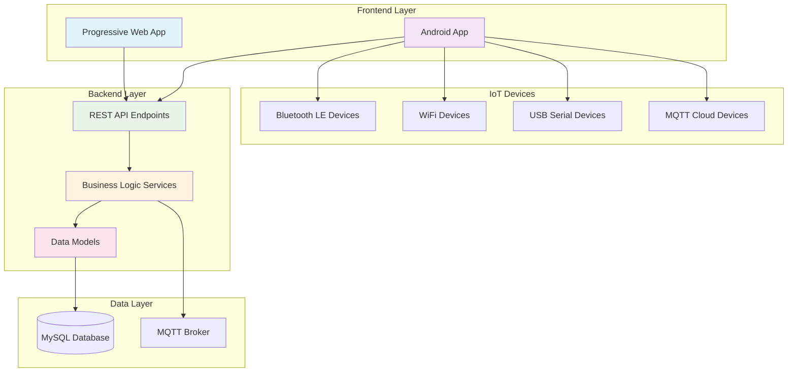
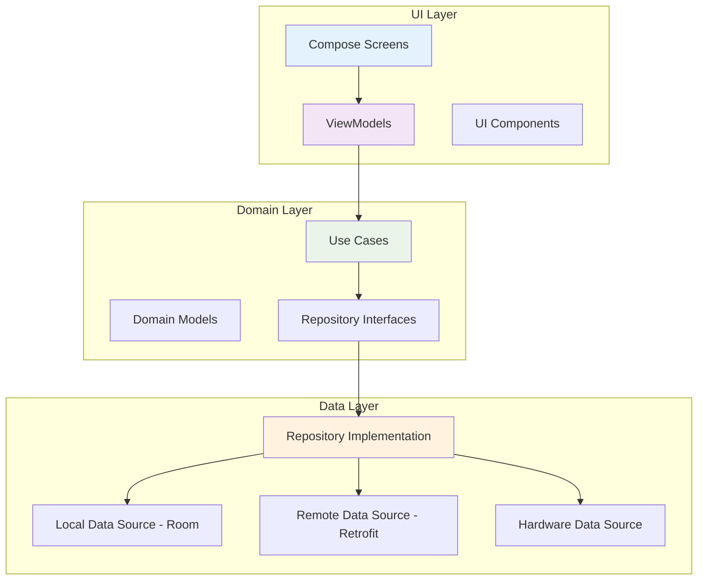
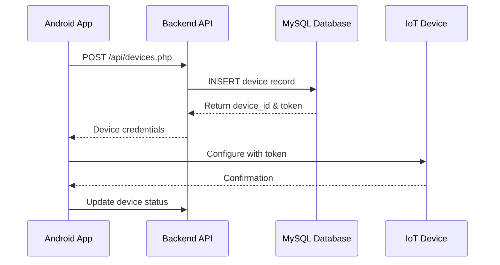
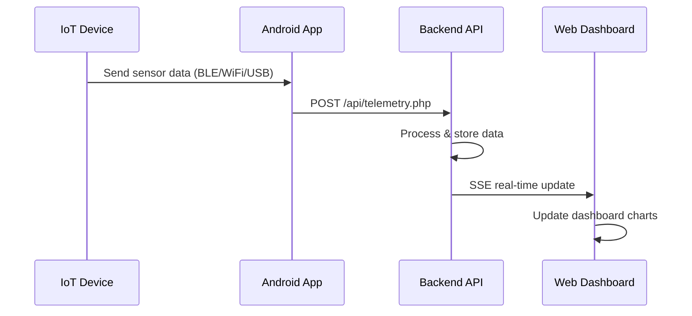
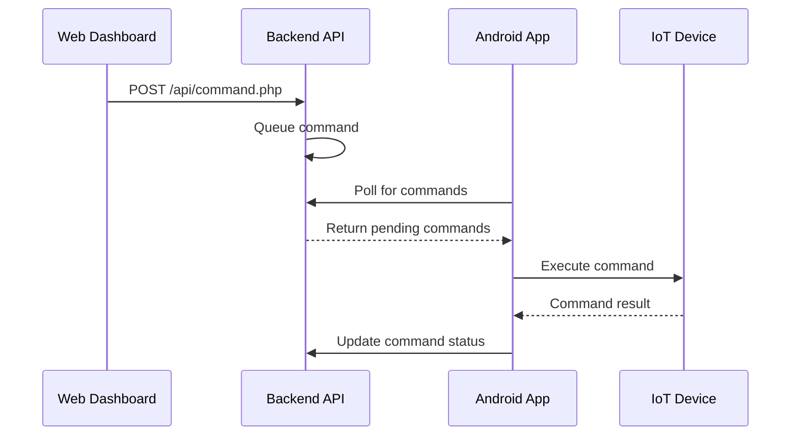

# IoT Logic Platform - Complete Codebase Analysis Guide

## Overview

The IoT Logic platform is a **full-stack IoT management system** that consists of three main components:

1. **Backend API** (PHP) - Server-side logic and database management
2. **Frontend PWA** (JavaScript) - Progressive Web Application for user interface
3. **Android Application** (Kotlin) - Mobile app for device management

## Architecture Overview



## Technology Stack Analysis

### Backend Technologies
- **PHP 7.4+**: Server-side scripting language
- **MySQL**: Relational database for data persistence
- **MQTT**: Message broker for real-time IoT communication
- **Apache/Nginx**: Web server
- **RESTful API**: HTTP-based API architecture

### Frontend Technologies
- **Progressive Web App (PWA)**: Offline-capable web application
- **Vanilla JavaScript**: Client-side interactivity
- **HTML5/CSS3**: Modern web standards
- **Server-Sent Events (SSE)**: Real-time data streaming
- **Service Workers**: Background sync and caching

### Android Technologies
- **Kotlin**: Primary programming language
- **Jetpack Compose**: Modern declarative UI framework
- **Clean Architecture + MVVM**: Architectural pattern
- **Hilt**: Dependency injection framework
- **Room**: Local database management
- **Retrofit**: HTTP client for API communication
- **Multiple Protocol Support**: BLE, WiFi, USB Serial, MQTT

## Directory Structure Analysis

```
blynk/
├── Blynk/                          # Backend PHP Application
│   ├── api/                        # REST API Endpoints
│   │   ├── devices.php            # Device management
│   │   ├── telemetry.php          # Sensor data collection
│   │   ├── command.php            # Device control commands
│   │   ├── authentication/        # User auth endpoints
│   │   └── realtime.php           # SSE for live updates
│   ├── app/                        # Application Logic
│   │   ├── Controllers/           # Request handling
│   │   ├── Models/                # Data access layer
│   │   ├── Services/              # Business logic
│   │   └── Middleware/            # Request filtering
│   ├── public/                     # Frontend PWA
│   │   ├── index.php              # Main entry point
│   │   ├── assets/                # CSS/JS files
│   │   ├── sw.js                  # Service Worker
│   │   └── manifest.json          # PWA manifest
│   ├── bridge/                     # MQTT Integration
│   │   ├── mqtt_bridge.php        # Device communication
│   │   └── mqtt_simulator.php     # Testing utilities
│   ├── scripts/                    # Maintenance scripts
│   └── config.php                 # Configuration settings
│
└── android/                        # Android Application
    ├── app/src/main/               # Main application code
    │   ├── java/com/iotlogic/blynk/
    │   │   ├── auth/               # Authentication
    │   │   ├── data/               # Data layer (Room, API)
    │   │   ├── domain/             # Business logic
    │   │   ├── hardware/           # Device communication
    │   │   ├── ui/                 # User interface (Compose)
    │   │   └── services/           # Background services
    │   └── res/                    # Resources (layouts, strings)
    ├── app/src/test/               # Unit tests
    ├── app/src/androidTest/        # Integration tests
    └── docs/                       # Documentation
```

## Backend Component Analysis

### 1. API Layer (`api/` directory)
**Purpose**: Handle HTTP requests and provide RESTful endpoints

| File | Purpose | Key Functions |
|------|---------|---------------|
| `devices.php` | Device CRUD operations | Register, list, update, delete devices |
| `telemetry.php` | Sensor data collection | Store and retrieve telemetry data |
| `command.php` | Device control | Send commands to IoT devices |
| `authentication/` | User management | Login, register, MFA, RBAC |
| `realtime.php` | Live data streaming | Server-Sent Events for real-time updates |

### 2. Application Layer (`app/` directory)

#### Controllers (`app/Controllers/`)
- **BaseController.php**: Common controller functionality
- Handle request validation and response formatting

#### Models (`app/Models/`)
- **BaseModel.php**: Database connection and common operations
- **DeviceModel.php**: Device data management
- **TelemetryModel.php**: Sensor data operations

#### Services (`app/Services/`)
- **AuthService.php**: User authentication logic
- **RuleEngine.php**: Automation rule processing
- **NotificationService.php**: Alert and notification handling
- **AnalyticsService.php**: Data analysis and reporting

#### Middleware (`app/Middleware/`)
- **AuthMiddleware.php**: Request authentication
- **RBACMiddleware.php**: Role-based access control
- **RateLimitMiddleware.php**: API rate limiting

### 3. Integration Layer (`bridge/` directory)
- **mqtt_bridge.php**: MQTT broker communication
- **mqtt_simulator.php**: Device simulation for testing

## Android Application Analysis

### Architecture Pattern: Clean Architecture + MVVM



### Key Android Components

#### 1. Authentication (`auth/`)
- **AuthenticationManager.kt**: Handles user login and token management
- Supports biometric authentication
- Secure token storage with EncryptedSharedPreferences

#### 2. Hardware Communication (`hardware/`)
- **HardwareManager.kt**: Coordinates multiple protocol adapters
- **bluetooth/**: Bluetooth LE device communication
- **wifi/**: WiFi device HTTP communication
- **usb/**: USB serial device communication
- **mqtt/**: MQTT cloud device communication

#### 3. Data Management (`data/`)
- **local/**: Room database for offline storage
- **remote/**: Retrofit API clients
- **repository/**: Data repository implementations
- **sync/**: Background synchronization

#### 4. User Interface (`ui/`)
- **screens/**: Jetpack Compose screens
- **components/**: Reusable UI components
- **viewmodel/**: MVVM ViewModels
- **theme/**: Material Design 3 theming

#### 5. Background Services (`services/`)
- **DeviceConnectionService.kt**: Maintains device connections
- **MqttBackgroundService.kt**: MQTT message handling

## Data Flow Architecture

### 1. Device Registration Flow



### 2. Telemetry Data Flow



### 3. Command Execution Flow



## How to Execute the Project Properly

### Prerequisites

1. **Development Environment Setup**
   ```bash
   # Required Software
   - XAMPP (Apache, MySQL, PHP)
   - Android Studio
   - Git
   - Node.js (optional, for build tools)
   ```

2. **Database Setup**
   ```sql
   -- Create database
   CREATE DATABASE iotlogic;
   
   -- Import schema
   mysql -u root -p iotlogic < database/db_schema.sql
   ```

### Backend Setup (PHP)

1. **XAMPP Configuration**
   ```bash
   # Place project in XAMPP htdocs
   C:\xampp\htdocs\blynk\
   
   # Start Apache and MySQL
   # Access: http://localhost/blynk
   ```

2. **Environment Configuration**
   ```php
   // config.php - Local development
   $DB_HOST = "localhost";
   $DB_USER = "root";
   $DB_PASS = "";
   $DB_NAME = "iotlogic";
   ```

3. **Test Backend API**
   ```bash
   # Test endpoints
   GET http://localhost/blynk/api/devices.php
   POST http://localhost/blynk/api/login.php
   ```

### Android Application Setup

1. **Open in Android Studio**
   ```bash
   # Open android/ directory
   File -> Open -> Select android folder
   ```

2. **Configure local.properties**
   ```properties
   # Add to android/local.properties
   API_BASE_URL="http://10.0.2.2/blynk/api/"  # For emulator
   # OR
   API_BASE_URL="http://YOUR_IP/blynk/api/"   # For physical device
   ```

3. **Build and Run**
   ```bash
   # In Android Studio
   Build -> Make Project
   Run -> Run 'app'
   ```

### Frontend PWA Setup

1. **Access Web Interface**
   ```bash
   # Open browser
   http://localhost/blynk/public/
   ```

2. **Test PWA Features**
   - Install PWA (Chrome: Settings -> Install App)
   - Test offline functionality
   - Verify real-time updates

## Testing Strategy

### Backend Testing
```php
// API endpoint testing
curl -X POST http://localhost/blynk/api/devices.php \
  -H "Content-Type: application/json" \
  -d '{"name":"Test Device","type":"sensor"}'
```

### Android Testing
```kotlin
// Unit tests
./gradlew test

// Integration tests
./gradlew connectedAndroidTest

// UI tests
./gradlew connectedDebugAndroidTest
```

### End-to-End Testing
1. Register device via Android app
2. Send telemetry data
3. Verify data appears in web dashboard
4. Execute command from web interface
5. Confirm command received on Android app

## Common Issues and Solutions

### 1. Database Connection Issues
```php
// Check MySQL service is running
// Verify credentials in config.php
// Test connection manually
$conn = new mysqli("localhost", "root", "", "iotlogic");
if ($conn->connect_error) {
    die("Connection failed: " . $conn->connect_error);
}
```

### 2. Android API Connection Issues
```kotlin
// For Android emulator, use 10.0.2.2 instead of localhost
// For physical device, use computer's IP address
// Check firewall settings
```

### 3. CORS Issues (Cross-Origin Requests)
```php
// Add to API endpoints
header('Access-Control-Allow-Origin: *');
header('Access-Control-Allow-Methods: GET, POST, PUT, DELETE');
header('Access-Control-Allow-Headers: Content-Type, Authorization');
```

## Security Considerations

### 1. Authentication
- JWT token-based authentication
- Secure token storage in Android
- Session management in PWA

### 2. Data Protection
- HTTPS for production
- SQL injection prevention
- Input validation and sanitization

### 3. Device Security
- Device token authentication
- Encrypted communication channels
- Rate limiting for API endpoints

## Performance Optimization

### 1. Database Optimization
- Proper indexing on device_id, timestamp columns
- Connection pooling
- Query optimization

### 2. Android Optimization
- Background sync with WorkManager
- Efficient memory management
- Battery optimization

### 3. Real-time Performance
- Server-Sent Events for live updates
- Efficient MQTT topic structure
- Connection management

## Development Workflow

1. **Start Backend Services**
   - Start XAMPP (Apache + MySQL)
   - Verify database connection
   - Test API endpoints

2. **Launch Android Development**
   - Open Android Studio
   - Start emulator or connect device
   - Configure API endpoints
   - Build and run application

3. **Test Integration**
   - Register test devices
   - Send/receive telemetry data
   - Execute commands
   - Monitor real-time updates

## Next Steps for Beginners

1. **Understand the Flow**
   - Start with the web interface
   - Register a virtual device
   - Use MQTT simulator to send test data

2. **Explore the Code**
   - Read through API endpoints
   - Understand data models
   - Examine Android architecture

3. **Make Small Changes**
   - Add new device properties
   - Create custom telemetry charts
   - Implement new device commands

4. **Advanced Features**
   - Implement automation rules
   - Add notification systems
   - Extend protocol support

This comprehensive guide provides a complete understanding of the IoT Logic platform, enabling you to execute, modify, and extend the system effectively.- **sync/**: Background synchronization

#### 4. User Interface (`ui/`)
- **screens/**: Jetpack Compose screens
- **components/**: Reusable UI components
- **viewmodel/**: MVVM ViewModels
- **theme/**: Material Design 3 theming

#### 5. Background Services (`services/`)
- **DeviceConnectionService.kt**: Maintains device connections
- **MqttBackgroundService.kt**: MQTT message handling

## Data Flow Architecture

### 1. Device Registration Flow


### 2. Telemetry Data Flow


### 3. Command Execution Flow


## How to Execute the Project Properly

### Prerequisites

1. **Development Environment Setup**
   ```bash
   # Required Software
   - XAMPP (Apache, MySQL, PHP)
   - Android Studio
   - Git
   - Node.js (optional, for build tools)
   ```

2. **Database Setup**
   ```sql
   -- Create database
   CREATE DATABASE iotlogic;
   
   -- Import schema
   mysql -u root -p iotlogic < database/db_schema.sql
   ```

### Backend Setup (PHP)

1. **XAMPP Configuration**
   ```bash
   # Place project in XAMPP htdocs
   C:\xampp\htdocs\blynk\
   
   # Start Apache and MySQL
   # Access: http://localhost/blynk
   ```

2. **Environment Configuration**
   ```php
   // config.php - Local development
   $DB_HOST = "localhost";
   $DB_USER = "root";
   $DB_PASS = "";
   $DB_NAME = "iotlogic";
   ```

3. **Test Backend API**
   ```bash
   # Test endpoints
   GET http://localhost/blynk/api/devices.php
   POST http://localhost/blynk/api/login.php
   ```

### Android Application Setup

1. **Open in Android Studio**
   ```bash
   # Open android/ directory
   File -> Open -> Select android folder
   ```

2. **Configure local.properties**
   ```properties
   # Add to android/local.properties
   API_BASE_URL="http://10.0.2.2/blynk/api/"  # For emulator
   # OR
   API_BASE_URL="http://YOUR_IP/blynk/api/"   # For physical device
   ```

3. **Build and Run**
   ```bash
   # In Android Studio
   Build -> Make Project
   Run -> Run 'app'
   ```

### Frontend PWA Setup

1. **Access Web Interface**
   ```bash
   # Open browser
   http://localhost/blynk/public/
   ```

2. **Test PWA Features**
   - Install PWA (Chrome: Settings -> Install App)
   - Test offline functionality
   - Verify real-time updates

## Testing Strategy

### Backend Testing
```php
// API endpoint testing
curl -X POST http://localhost/blynk/api/devices.php \
  -H "Content-Type: application/json" \
  -d '{"name":"Test Device","type":"sensor"}'
```

### Android Testing
```kotlin
// Unit tests
./gradlew test

// Integration tests
./gradlew connectedAndroidTest

// UI tests
./gradlew connectedDebugAndroidTest
```

### End-to-End Testing
1. Register device via Android app
2. Send telemetry data
3. Verify data appears in web dashboard
4. Execute command from web interface
5. Confirm command received on Android app

## Common Issues and Solutions

### 1. Database Connection Issues
```php
// Check MySQL service is running
// Verify credentials in config.php
// Test connection manually
$conn = new mysqli("localhost", "root", "", "iotlogic");
if ($conn->connect_error) {
    die("Connection failed: " . $conn->connect_error);
}
```

### 2. Android API Connection Issues
```kotlin
// For Android emulator, use 10.0.2.2 instead of localhost
// For physical device, use computer's IP address
// Check firewall settings
```

### 3. CORS Issues (Cross-Origin Requests)
```php
// Add to API endpoints
header('Access-Control-Allow-Origin: *');
header('Access-Control-Allow-Methods: GET, POST, PUT, DELETE');
header('Access-Control-Allow-Headers: Content-Type, Authorization');
```

## Security Considerations

### 1. Authentication
- JWT token-based authentication
- Secure token storage in Android
- Session management in PWA

### 2. Data Protection
- HTTPS for production
- SQL injection prevention
- Input validation and sanitization

### 3. Device Security
- Device token authentication
- Encrypted communication channels
- Rate limiting for API endpoints

## Performance Optimization

### 1. Database Optimization
- Proper indexing on device_id, timestamp columns
- Connection pooling
- Query optimization

### 2. Android Optimization
- Background sync with WorkManager
- Efficient memory management
- Battery optimization

### 3. Real-time Performance
- Server-Sent Events for live updates
- Efficient MQTT topic structure
- Connection management

## Development Workflow

1. **Start Backend Services**
   - Start XAMPP (Apache + MySQL)
   - Verify database connection
   - Test API endpoints

2. **Launch Android Development**
   - Open Android Studio
   - Start emulator or connect device
   - Configure API endpoints
   - Build and run application

3. **Test Integration**
   - Register test devices
   - Send/receive telemetry data
   - Execute commands
   - Monitor real-time updates

## Next Steps for Beginners

1. **Understand the Flow**
   - Start with the web interface
   - Register a virtual device
   - Use MQTT simulator to send test data

2. **Explore the Code**
   - Read through API endpoints
   - Understand data models
   - Examine Android architecture

3. **Make Small Changes**
   - Add new device properties
   - Create custom telemetry charts
   - Implement new device commands

4. **Advanced Features**
   - Implement automation rules
   - Add notification systems
   - Extend protocol support

This comprehensive guide provides a complete understanding of the IoT Logic platform, enabling you to execute, modify, and extend the system effectively.


