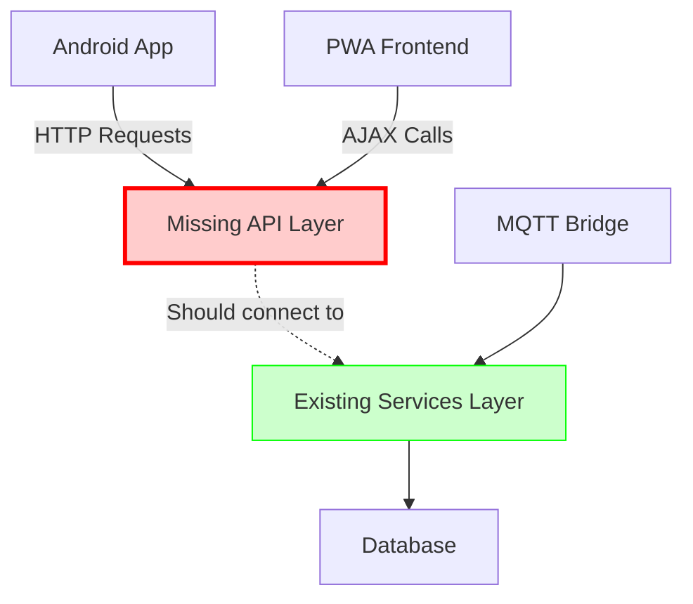
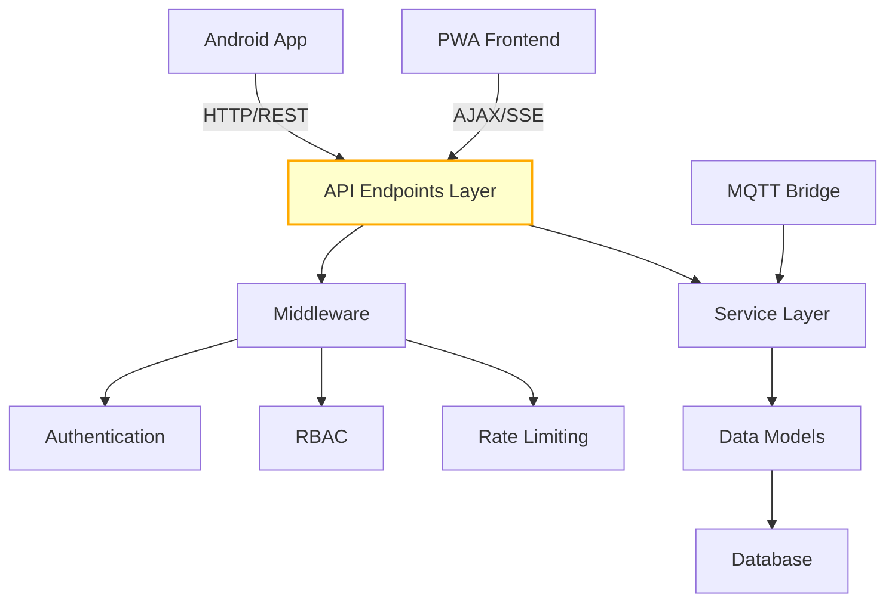

# IoT Platform Backend API Implementation Analysis

## Overview

This document analyzes the current implementation status of the IoT Logic platform and identifies the missing component that prevents the system from functioning as a complete solution. The analysis reveals that while the platform has a comprehensive Android application, backend services, and frontend interface, **the critical REST API endpoints layer is missing**.

## Current Implementation Status

### ✅ Fully Implemented Components

#### 1. Android Application (Complete)
- **Architecture**: Clean Architecture with MVVM pattern
- **Key Features**:
  - Multi-protocol device support (BLE, WiFi, USB Serial, MQTT)
  - Offline functionality with sync manager
  - Background synchronization using WorkManager
  - Local data persistence with Room database
  - Hardware abstraction layer with protocol adapters
  - Real-time telemetry monitoring
  - Push notifications via FCM
  - Geofencing and location services
  - Biometric authentication
  - Comprehensive testing suite

#### 2. Backend Service Layer (Complete)
- **Authentication Services**: AuthService, MFAService
- **Device Management**: DeviceModel, TelemetryModel
- **Protocol Adapters**: BLE, LoRa, LoRaWAN, WiFi adapters
- **Business Logic**: RuleEngine, AnalyticsService, NotificationService
- **Security**: RBAC, Rate limiting, anomaly detection
- **Data Access**: BaseModel with consistent database operations

#### 3. Frontend PWA Interface (Complete)
- **Progressive Web App** with offline capabilities
- **Service Worker** implementation
- **Real-time updates** via Server-Sent Events
- **Dashboard customization** features
- **Device management** interface

#### 4. Integration Components (Complete)
- **MQTT Bridge**: Real-time device communication
- **MQTT Simulator**: Testing and development support
- **Database Schema**: Comprehensive data model

### ❌ Missing Critical Component

## Missing REST API Endpoints Layer

The analysis reveals that **all API endpoint files referenced by the frontend are missing**. The frontend expects these endpoints:

### Required API Endpoints Structure

```
api/
├── devices.php          # Device management endpoints
├── telemetry.php        # Telemetry data endpoints  
├── command.php          # Device command endpoints
├── login.php           # Authentication endpoints
├── realtime.php        # Server-sent events endpoint
├── automation.php      # Automation rules endpoints
├── analytics.php       # Analytics and reporting
├── notifications.php   # Notification management
├── security.php        # Security and RBAC endpoints
└── dashboard.php       # Dashboard configuration
```

## Architecture Analysis

### Current System Flow (Broken)


### Required System Flow (After Implementation)


## Required API Implementation

### 1. Device Management API (`api/devices.php`)

**Endpoints Required**:
- `GET /api/devices.php` - List user devices
- `POST /api/devices.php` - Create new device
- `PUT /api/devices.php` - Update device configuration
- `DELETE /api/devices.php` - Remove device

**Integration Points**:
- DeviceModel for data operations
- AuthMiddleware for user authentication
- RBACMiddleware for permission control

### 2. Telemetry Data API (`api/telemetry.php`)

**Endpoints Required**:
- `GET /api/telemetry.php` - Retrieve telemetry data
- `POST /api/telemetry.php` - Store incoming telemetry
- `GET /api/telemetry.php?aggregated=true` - Aggregated analytics

**Integration Points**:
- TelemetryModel for data storage
- AnalyticsService for data processing
- RuleEngine for automation triggers

### 3. Command System API (`api/command.php`)

**Endpoints Required**:
- `GET /api/command.php` - List pending commands
- `POST /api/command.php` - Send device commands
- `PUT /api/command.php` - Update command status

**Integration Points**:
- DeviceModel for command validation
- ProtocolAbstractionService for protocol handling
- NotificationService for command feedback

### 4. Authentication API (`api/login.php`)

**Endpoints Required**:
- `POST /api/login.php` - User authentication
- `POST /api/login.php?action=mfa` - MFA verification
- `POST /api/login.php?action=refresh` - Token refresh

**Integration Points**:
- AuthService for authentication logic
- MFAService for multi-factor authentication
- RateLimitService for security

### 5. Real-time Communication (`api/realtime.php`)

**Server-Sent Events Implementation**:
- Real-time telemetry updates
- Command status notifications
- System alerts and notifications

**Integration Points**:
- MQTT Bridge for device events
- NotificationService for alerts
- AnalyticsService for real-time metrics

### 6. Automation Engine API (`api/automation.php`)

**Endpoints Required**:
- `GET /api/automation.php?action=rules` - List automation rules
- `POST /api/automation.php` - Create automation rule
- `PUT /api/automation.php` - Update rule configuration
- `DELETE /api/automation.php` - Remove automation rule

**Integration Points**:
- RuleEngine for rule processing
- DeviceModel for device validation
- NotificationService for rule notifications

## Implementation Requirements

### API Endpoint Template Structure

Each API endpoint should follow this pattern:

```php
<?php
require_once '../config.php';
require_once '../app/Middleware/AuthMiddleware.php';
require_once '../app/Middleware/RBACMiddleware.php';
require_once '../app/Middleware/RateLimitMiddleware.php';
require_once '../app/Services/[RequiredService].php';
require_once '../app/Models/[RequiredModel].php';

// Apply middleware
$auth = new AuthMiddleware();
$rbac = new RBACMiddleware();
$rateLimit = new RateLimitMiddleware();

// Rate limiting
if (!$rateLimit->checkLimit($_SERVER['REMOTE_ADDR'], 'api_endpoint')) {
    http_response_code(429);
    echo json_encode(['error' => 'Rate limit exceeded']);
    exit;
}

// Authentication
$user = $auth->authenticate();
if (!$user) {
    http_response_code(401);
    echo json_encode(['error' => 'Unauthorized']);
    exit;
}

// RBAC authorization
if (!$rbac->hasPermission($user, 'required_permission')) {
    http_response_code(403);
    echo json_encode(['error' => 'Forbidden']);
    exit;
}

// Handle HTTP methods
switch ($_SERVER['REQUEST_METHOD']) {
    case 'GET':
        handleGet();
        break;
    case 'POST':
        handlePost();
        break;
    case 'PUT':
        handlePut();
        break;
    case 'DELETE':
        handleDelete();
        break;
    default:
        http_response_code(405);
        echo json_encode(['error' => 'Method not allowed']);
}
```

### Middleware Integration

All endpoints must integrate with existing middleware:

1. **AuthMiddleware**: User authentication and token validation
2. **RBACMiddleware**: Role-based access control
3. **RateLimitMiddleware**: Request rate limiting and abuse prevention

### Service Layer Integration

Each endpoint should utilize appropriate service classes:

- **AuthService**: Authentication operations
- **DeviceModel**: Device data operations  
- **TelemetryModel**: Telemetry data management
- **RuleEngine**: Automation rule processing
- **NotificationService**: Alert and notification handling
- **AnalyticsService**: Data analytics and reporting

### Security Requirements

1. **Input Validation**: Sanitize all incoming data
2. **SQL Injection Prevention**: Use prepared statements
3. **XSS Protection**: Escape output data
4. **CSRF Protection**: Implement token-based CSRF protection
5. **Rate Limiting**: Apply per-endpoint rate limits
6. **Authentication**: Validate user tokens
7. **Authorization**: Check user permissions

### Response Format Standardization

All APIs should return consistent JSON responses:

```json
{
  "status": "success|error",
  "data": {},
  "message": "Human readable message",
  "meta": {
    "total": 100,
    "page": 1,
    "per_page": 20
  }
}
```

## Impact Analysis

### Current System Limitations

Without the API layer:
- **Android app cannot sync** with backend
- **Frontend dashboard non-functional** for data operations
- **No remote device control** capability
- **Authentication system isolated** from applications
- **Real-time features unavailable**

### Post-Implementation Benefits

With complete API implementation:
- **Full system integration** between all components
- **Mobile-web synchronization** for seamless user experience
- **Remote IoT device management** capabilities
- **Real-time monitoring and control** functionality
- **Scalable multi-user platform** with proper security

## Testing Requirements

### API Testing Strategy

1. **Unit Tests**: Individual endpoint functionality
2. **Integration Tests**: Service layer integration
3. **Authentication Tests**: Security middleware validation
4. **Performance Tests**: Load and stress testing
5. **Security Tests**: Vulnerability and penetration testing

### Test Coverage Areas

- Authentication and authorization flows
- Data validation and sanitization
- Error handling and edge cases
- Rate limiting effectiveness
- Real-time communication reliability
- Cross-platform compatibility

## Conclusion

The IoT Logic platform represents a well-architected solution with comprehensive mobile application, robust backend services, and modern frontend interface. However, the **missing REST API endpoints layer** prevents the system from functioning as an integrated platform.

The implementation of the identified API endpoints is the **single remaining requirement** to transform this codebase from separate components into a fully functional, production-ready IoT management platform. All underlying infrastructure, services, and applications are complete and ready for API integration.

**Priority**: Critical - System non-functional without API implementation  
**Effort**: Moderate - Leveraging existing service layer and middleware  
**Dependencies**: None - All required components already implemented